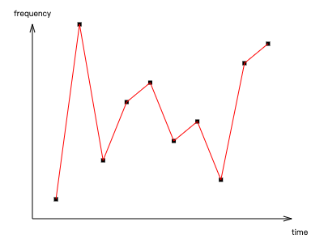

<h1 style="font-size:40px; font-style:italic">Canvas Notes</h1>
[TOC]

# 1. canvas简介

## 1.1 什么是canvas

-   `canvas`是HTML5提供的一种新标签

	```html
	<canvas></canvas>
	```

-   `canvas`是一个矩形区域的**画布**，可以用JavaScript在上面绘画，控制器每一个像素

-   `canvas`标签使用JavaScript在网页上绘制图像，本身不具备绘画功能

-   `canvas`拥有多种绘制路径、矩形、圆形、字符以及添加图像的方法

-   HTML5之前的web页面只能用一些固定样式的标签：比如`p` `div` `h1`等，但有了`canvas`，web页面可以丰富起来

## 1.2 canvas主要应用的领域

- 游戏：canvas在基于web的图像显示方面比flash更加立体、更加精巧，canvas游戏在流畅度和跨平台方面更牛。
- 可视化数据，数据图表化，比如：百度的echarts
- banner广告：HTML5在banner上，用canvas实现动态的广告效果非常合适
- 未来=>模拟器：无论从视觉效果还是核心功能方面，模拟器产品可以完全由JavaScript来实现
- 未来=>远程计算机控制：canvas可以让开发者更好的基于web的数据传输，构建一个完美的可视化控制界面
- 未来=>图形编辑器：Photoshop图形编辑器基于web实现
- 其他可嵌入网站的内容：类似图表、音频、视频，还有很多元素能够更好的和web融合，并且不需要插件
- 完整的canvas移动化应用


# 2. canvas绘图基础

## 2.1 canvas标签

### 2.1.1 canvas标签语法和属性

-   canvas：普通html双标签
-   可以给标签设置`width` `height`属性，属性单位必须是px，否则忽略

注意：

-   不要使用css设置canvas的宽高，否则会进行拉伸变形

-   重新设置canvas的宽高属性会让画布擦除所有的内容
-   可以给canvas画布设置背景色

### 2.1.2 浏览器不兼容处理

-   IE9及以上才支持canvas，其他Chrome、firefox、safari等浏览器都支持

-   只要浏览器兼容canvas，那么就会支持绝大部分api（个别最新的api除外）

-   移动端的兼容情况非常理想，基本上随便使用

-   2d的支持都非常好，3d的只有IE11及以上才支持，其他浏览器都支持

-   如果浏览器不兼容，最好进行友好提示，直接写在`canvas`标签里，

    -   当浏览器兼容时，会将`canvas`标签作为画布进行处理
    -   如果不兼容时，则会当做普通`div`处理，因此写进去的友好提示会显示出来

    ```html
    <canvas>
    	您的浏览器不支持canvas，请升级浏览器。
    </canvas>
    ```

-   当浏览器不兼容时，可以在`canvas`标签中使用flash等手段进行降级

    ```html
    <canvas>
    	<!--flash-->
    </canvas>
    ```


## 2.2 canvas绘图上下文 context

### 2.2.1 context

-   context：canvas的上下文、绘制环境，是所有的绘制操作api的入口或者集合
-   `Context`对象就是JavaScript操作`canvas`的接口
-   使用`[CanvasElement].getContext("2d")` 来获取2D绘图上下文

```js
var canvas = document.getElementById("canvasId");
var ctx = canvas.getContext("2d");
// 3D的使用"webgl"
// var 3dCtx = canvas.getContext("webgl");
```

### 2.2.2 基本函数

-   画笔移动到某处：`ctx.moveTo(x, y)`：
-   画笔描边：`ctx.stroke()`
-   画笔描边的颜色：`ctx.strokeStyle([颜色])`
    -   颜色支持css中的各种颜色格式，包括颜色单词、rgb/rgba、十六进制等
-   填充闭合曲线：`ctx.fill()`
-   填充颜色：`ctx.fillStyle([颜色])`
-   添加新的绘制路径：`ctx.beginPath()`
    -   新绘画路径中设置的样式只在当前路径中生效

### 2.2.3 绘画环境的保存和恢复

-   绘制环境保存：`ctx.save()`
    -   将当前的绘制环境保存到缓存中
-   绘制环境还原：`ctx.restore()`
    -   返回之前保存过的路径状态和属性，获取最近缓存过的ctx

>   为了不影响其他的绘图环境，在每次绘制图像的前面，应当保存绘制环境，并在结束时还原之前的环境。
>
>   ```js
>   function drawSomething(ctx) {
>       ctx.save();
>       // 绘图代码
>       ctx.restore();
>   }
>   drawSomething();
>   ```

## 2.3 绘制直线

-   划线：`ctx.lineTo(x, y)`
-   设置线宽：`ctx.lineWidth = [线宽]`
    -   `[线宽]`：number，像素

```js
// var canvas = document.getElementById("canvasId");
// var ctx = canvas.getContext("2d");
ctx.moveTo(100, 100);
ctx.lineTo(200, 200);
ctx.stroke();
```


## 2.4 绘制矩形（rect）

### 2.4.1 描边矩形

-   先绘制路径，再描边：

    ```js
    // ctx.moveTo(100, 100);
    ctx.rect(100, 100, 300, 300); // (x, y, w, h)
    ctx.stroke();
    ```

-   直接描出矩形：

    ```js
    // ctx.moveTo(100, 100);
    ctx.strokeRect(100, 100, 300, 300);	// (x, y, w, h)
    ```

### 2.4.2 填充矩形

-   线绘制路径，再填充：

    ```js
    // ctx.moveTo(100, 100);
    ctx.rect(100, 100, 300, 300);
    ctx.fill();
    ```
-	直接填充矩形：

	```js
	// ctx.moveTo(100, 100);
	ctx.fillRect(100, 100, 300, 300);
	```

### 2.4.3 清除矩形

-   清除某矩形内的绘制内容，相当于橡皮擦：

    ```js
    ctx.clearRect(x, y, width, height);
    ```


## 2.5 绘制圆弧（arc）

-   `ctx.arc(x, y, radius, startAngle, endAngle, counterClockWise)`

    -   `x, y`：（number）圆心坐标
    -   `radius`：（number）半径
    -   `startAngle` `endAngle`：起始/结束角度，以弧度为单位，如：
        -   30°：`startAngle = 30 * Math.PI / 180`
    -   `counterClockWise`：（boolean）是否是逆时针，默认为``false`

```js
ctx.moveTo(100, 100);
ctx.arc(100, 100, 50, 30*Math.PI/180, -30*Math.PI/180, true);
ctx.closePath();
ctx.stroke();
// ctx.fill();
```


## 2.6 绘制文字

-   绘制被填充的文本：`ctx.fillText([文本], x, y)`

-   绘制描边（不填充）的文本：`ctx.strokeText([文本], x, y)`

-   返回包含指定文本宽度的对象：`ctx.measureText([文本])`

    ```js
    ctx.measureText("text").width;
    // TextMetrics {width: 24.835952758789062}
    ```

```js
ctx.moveTo(300, 300);
ctx.fillStyle = "purple";
ctx.font = "20px '微软雅黑'";
ctx.textBaseline = "bottom";
ctx.textAlign = "left";
ctx.strokeText("This is a stroked text.", 450, 400);
ctx.fillText("This is a filled text.", 100, 300);
```


## 2.7 绘制图片

-   基本绘制图片的方式：`ctx.drawImage(img, x, y, width, height)`

    -   `img`：图片的dom对象
    -   `x` `y`：图片的坐标

    -   `width` `height`：(optional) 绘制图片的宽度/高度
        -   如果指定了宽高，最好成比例，不然图片会被拉伸
        -   等比公式：$toH = H \times toW / W$
            -   $toH$ $toW$：设置高、宽
            -   $H$ $W$：实际高、宽
    ```js
        let img = new Image();
        img.src = "./images/dom.png"
        // 需要等图片加载后执行canvas绘制图片
        img.onload = function() {
        ctx.drawImage(img, 0, 0, 400, 200);

        // 给定宽度，保持宽高比
        let toW = 400,
            toH = toW * img.height / img.width;
        ctx.drawImage(img, 100, 100, toW, toH);
    }
    ```
    
-   画布渲染画布：将一个画布放进另一个画布中

    ```js
    let canvas1 = document.querySelector(".canvas1"),
        canvas2 = document.querySelector(".canvas2"),
        ctx1 = canvas1.getContext('2d'),
        ctx2 = canvas2.getContext('2d');
    ctx2.drawImage(canvas1, 10, 10);
    ```

-   图片裁剪：`ctx.drawImage(img, sx, sy, swidth, sheight, x, y, width, height)`
    -   `img`：图片的dom对象
    -   `sx` `sy`：裁剪的左上角坐标
    -   `swidth` `wheight`：裁剪的宽高
    -   `x` `y` `width` `height`：同图片基本绘制方式中的参数

## 2.8 设置阴影

>   一般不用，为了更高的性能，用图片代替

- 设置阴影的颜色：`ctx.shadowColor`
- 设置阴影的模糊级别：`ctx.shadowBlur`
    - 设置大于1的正整数，数值越高，模糊程度越大
- 设置阴影的水平距离：`ctx.shadowOffsetX`
- 设置阴影的垂直距离：`ctx.shadowOffsetY`

## 2.9 设置线性渐变

>   一般不用，为了更高的性能，用图片代替

-   设置线性渐变：`ctx.createLinearGradient(x0, y0, x1, y1)`
    -   `x0` `y0`：起始坐标
    -   `x1` `y1`：结束坐标
-   添加渐变颜色：`grd.addColorStop(0, “black”)`
    -   第一个参数为0-1之间的值，表示开始到结束之间的位置

```js
let grd = ctx.createLinearGradient(0, 0, 170, 0);
grd.addColorStop(0, "black");
grd.addColorStop(1, "red");
ctx.fillStyle = grd;
ctx.fillRect(0, 0, 100, 100);
```

## 2.10 设置圆形渐变

>   一般不用，为了更高的性能，用图片代替

-   设置圆形渐变：`ctx.createRadialGr`
-   `adient(x0, x0, r0, x1, y1, r1)`
    -   `x0` `y0`：渐变的开始的圆的x y坐标
    -   `r0`：开始圆的半径
    -   `x1` `y1`：渐变的结束的圆的x y坐标
    -   `r1`：结束圆的半径

```js
let rlg = ctx.createRadialGradient(300, 300, 10, 300, 300, 200);
rlg.addColorStop(0, 'teal');
rlg.addColorStop(.4, 'navy');
rlg.addColorStop(1, 'purple');
ctx.fillStyle = rlg;
ctx.fillRect(100, 100, 500, 500);
```

## 2.11 绘制背景图

>   一般不用，为了更高的性能，用图片代替

-   在指定方向内重复指定的元素：`ctx.createPattern(img, pattern)`
    -   `img`：背景的图片、画布或者视频元素
    -   `pattern`：背景平铺的模式
        -   `repeat`：默认，水平、垂直方向重复
        -   `repeat-x`：只在水平方向重复
        -   `repeat-y`：只在垂直方向重复
        -   `no-repeat`：不重复

```js
let img = document.getElementById("lamp");
let pat = ctx.createPattern(img, "repeat");
ctx.rect(0, 0, 150, 100);
ctx.fillStyle = pat;
ctx.fill();
```

## 2.12 变换

-   缩放：`ctx.scale(scaleWidth, scaleHeight)`
    -   `scaleWidth` `scaleHeight`：1-100%、5-50%、2-200%
    -   缩放的是整个画布，缩放后，继续绘制的图形会被放大或缩小
-   位移画布：`ctx.translate(x, y)`
    -   重新映射画布上的（0, 0）位置
    -   `x` `y `：将画布的(0, 0)坐标更新到新的x, y
-   旋转：`ctx.rotate(angle)`
    -   `angle`：围绕画布的（0, 0）点顺时针旋转的角度（注意是弧度）
-   设置环境的透明度：`ctx.globalAlpha = alpha`
    -   `alpha`介于0-1，0为完全透明，1位不透明


# 3 Canvas练习

## 3.1 绘制序列帧

```js
let origin = {
    // 'imgPath': './images/animation.png',
    'imgPath': './images/RYU1_wait.gif',
    // 'imgPath': './images/frame1.jpg',
    'x': 100,
    'y': 300,
    'index': 0,
    'toW': 100,
    'numRow': 1,
    'numCol': 6,
    'dt': 60
};
let timer;
let frameSequence = function (o){
    // 对序列帧图片进行设置
    let img = new Image();
    img.src = o.imgPath;
    o.sx = 0,
    o.sy = o.index * img.height / o.numRow;
    o.swidth = img.width / o.numCol;
    o.sheight = img.height / o.numRow;
    o.toH = o.toW * o.sheight / o.swidth;
    img.onload = ()=>{
        // 绘制序列帧的核心部分
        timer = setInterval(()=>{
            ctx.clearRect(o.x, o.y, o.toW, o.toH);
            ctx.drawImage(img, o.sx, o.sy, o.swidth, o.sheight, o.x, o.y, o.toW, o.toH);
            o.sx = (o.sx + o.swidth) % img.width;
        }, o.dt);
    }
}
```


##  3.2 绘制坐标系

```js
/* Figure 绘制图像的类 */
class Figure {
    constructor(width, height) {
        this.canvas = document.createElement('canvas');
        this.canvas.width = width;
        this.canvas.height = height;
        this.ctx = this.canvas.getContext('2d'),
        this.mainColor = "#000";
        [this.width, this.height] = [.8*this.canvas.width, .8*this.canvas.height];
        [this.x0, this.y0] = [.1 * this.canvas.width, .9 * this.canvas.height];
        [this.arrowWidth, this.arrowHeight] = [3, 10];
        this.init();
    }
    // 绘制坐标系
    init() {
        this.ctx.beginPath();
        this.ctx.strokeStyle = this.mainColor;
        this.ctx.lineWidth = '1px';

        this.ctx.moveTo(this.x0, this.y0);
        this.ctx.lineTo(this.x0 + this.width, this.y0);
        this.ctx.lineTo(this.x0 + this.width - this.arrowHeight, this.y0 - this.arrowWidth);
        this.ctx.moveTo(this.x0 + this.width, this.y0);
        this.ctx.lineTo(this.x0 + this.width - this.arrowHeight, this.y0 + this.arrowWidth);

        this.ctx.moveTo(this.x0, this.y0);
        this.ctx.lineTo(this.x0, this.y0 - this.height);
        this.ctx.lineTo(this.x0 - this.arrowWidth, this.y0 - this.height + this.arrowHeight);
        this.ctx.moveTo(this.x0, this.y0 - this.height);
        this.ctx.lineTo(this.x0 + this.arrowWidth, this.y0 - this.height + this.arrowHeight);

        this.ctx.stroke();
    }
    // 显示canvas
    show() {
        document.getElementsByTagName('body')[0].appendChild(this.canvas);
    }
    // 绘制数据
    plot(data) {
        // 绘图设置
        this.ctx.beginPath();
        this.xdata = data.x;
        this.ydata = data.y;
        this.xlabel = data.xlabel || 'x';
        this.ylabel = data.ylabel || 'y';
        this.ctx.strokeStyle = data.color || 'red';
        this.markerSize = data.markerSize || '5';
        this.title = data.title || '';

        let xLen = this.xdata.length,
            maxY = Math.max(...this.ydata),
            xInterval = this.width / (xLen + 1);

        // 将数据转换为像素坐标
        this.xcoor = this.xdata.map((x, xdata)=>{
            return this._transXToCoor(x, xInterval);
        })
        this.ycoor = this.ydata.map((y, ydata)=>{
            return this._transYToCoor(y, maxY);
        })

        // 绘制曲线
        this.ctx.moveTo(this.xcoor[0], this.ycoor[0]);
        this.xcoor.forEach((x, i)=>{
            this.ctx.lineTo(this.xcoor[i], this.ycoor[i]);
            this.ctx.fillRect(this.xcoor[i]-.5*this.markerSize, this.ycoor[i]-.5*this.markerSize, this.markerSize, this.markerSize);
        }) 
        this.ctx.stroke();

        // 绘制label
        this.ctx.beginPath();
        this.ctx.strokeStyle = this.mainColor;
        let xlabelLen = this.ctx.measureText(this.xlabel).width,
            ylabelLen = this.ctx.measureText(this.ylabel).width;
        console.log(xlabelLen, ylabelLen);
        this.ctx.fillText(this.xlabel, this.x0 + this.width, this.y0 + xlabelLen);
        this.ctx.fillText(this.ylabel, this.x0 - .5*ylabelLen, this.y0 - this.height - 10);
        this.ctx.stroke();
    }
    _transXToCoor(x, xInterval) {
        return this.x0 + x * xInterval;
    }
    _transYToCoor(y, maxY) {
        return this.y0 - y / maxY * this.height;
    }
}
```

调用：

```js
let figure = new Figure(400, 300),
    data = {
        'x': [1, 2, 3, 4, 5, 6, 7, 8, 9, 10],
        'y': [1, 10, 3, 6, 7, 4, 5, 2, 8, 9],
        'xlabel': 'time',
        'ylabel': 'frequency'
    };
figure.plot(data);
figure.show();
```



