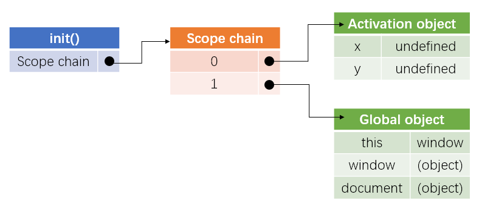
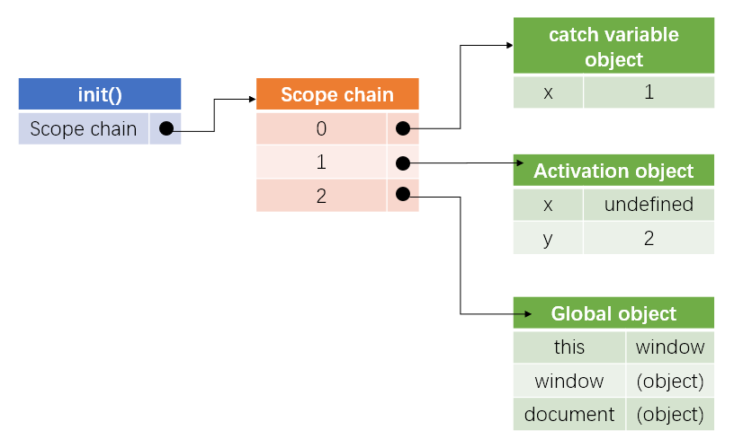
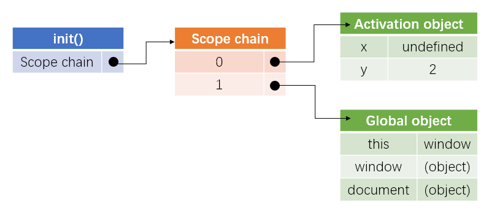

# 前端知识每日练习

1. 下面的代码执行时输出什么？说明。

   ```js
   console.log(false == '0');
   console.log(false === '0');
   ```

   <details><summary><b>答案</b></summary>
   <p>
    执行结果为：

   ```js
   true
   false
   ```

   知识点：`==`的隐式类型转换和`===`用法

   解析：

   在JavaScript中，有两套相等运算符。三重相等运算符`===`的行为与任何传统的相等运算符相同：如果两侧的表达式具有相同的类型和相同的值，则计算结果为`true`。然而，双等号运算符在比较它们之前试图进行类型转换成`Number()`，将`false`转换为`0`,`‘0’`也转换为`0`，二者相等。因此，通常使用`===`来判断二者是否真的相等，而不是`==`。对于`!==`和`!=`也是如此。
   </p>
   </details>

---

2. 考虑下面的代码。输出是什么，为什么？

   ```js
   (function () {
       try {
           throw new Error();
       }catch(x) {
           var x = 1, y = 2;
           console.log(x);
       }
       console.log(x);
       console.log(y);
   })();
   ```
   <details><summary><b>答案</b></summary>
   <p>
   执行结果为：

   ```js
   1
   undefined
   2
   ```

   知识点：预编译、作用域链、`with`和`catch`对作用域链的改变

   解析：

   1. 函数预编译：在函数预编译时，`var`语句被挂起（不包含值的初始化）到它所属的全局或函数作用域的顶部。即：

      

   2. **`with`与`catch`内的在执行时，其执行期上下文的作用域会被临时改变**，生成了一个新的可变对象并推入作用域链的头部，此时函数原本的局部变量现在处于第二个作用域链对象中。见下图：

      

      此时，第六行的`console.log(x)`从临时对象`catch variable object`中索取`x`，输出1。

   3. `catch`语句执行结束后，catch临时生成的可变对象被销毁，此时作用域链的顶端为函数的AO，如下图：

      

      此时，第8行和第9行分别输出`x`和`y`的值，得到`undefined`和`2`。
   </p>
   </details>

---

3. 以下代码的输出是什么？解释你的答案。

   ```js
   var a = {},
       b = {key: 'b'},
       c = {key: 'c'};
   a[b] = 123;
   a[c] = 456;
   console.log(a[b]);
   ```
    <details><summary><b>答案</b></summary>
   <p>
   知识点：对象的属性访问与赋值

   解析：

   访问对象的属性有两种方式，一种是`obj.prop`，另一种是`obj[str(prop)]`。

   - 其中`obj.prop`会隐式的将`prop`使用`toString()`方法转化成为字符串类型`str(prop)`，然后再调用`obj[str(prop)]`。
   - 使用`obj[prop]`时，如果`prop`不是字符串，那么也会隐式调用`toString()`方法转化为字符串类型的`str(prop)`，再调用`obj[str(prop)]`。

   因此，第4行的`a[b]`相当于`a[b.toString()]`，由于`b`是对象，则`b.toString()`为`"[object Object]"`，即相当于`a["[object Object]"]=123`，此时`a`为：

   ```js
   a = {
       "[object Object]": 123,
   }
   ```

   同理，第5行的`a[c]-->a[c.toString()]-->a["[object Object]"]`，并赋值为`456`，将原`"[object Object]"`属性值覆盖成了`456`。

   ```js
   a = {
       "[object Object]": 456,
   }
   ```

   因此，第6行`console.log(a[b])`相当于`console.log(a["object Object"])`得到`456`。

---

4. 考虑下面两个函数，他们都会返回同样的值吗？为什么或者为什么不？

   ```js
   function foo1() {
       return {
           bar: "hello"
       };
   }
   
   function foo2() {
       return
       {
           bar: "hello"
       };
   }
   ```
   <details><summary><b>答案</b></summary>
   <p>

   解析：不会返回同样的值，`foo1();`执行返回为对象`{bar: 'hello'}`，而`foo2();`执行返回空值，为`undefined`。

   因为如果每一行代码是一个可执行的语句，虽然没有加`;`，但是系统会隐式的添加上`;`，然后解释一行执行一行，第二个函数执行到`return`就停止了。

   因此，JavaScript通常约定一行开头的大括号应放在行尾，而不是放在新行的开头，避免出现上述情况。
   </p>
   </details>

---

5. 以下代码的输出是什么，解释你的答案。如何在这里使用闭包？

   ```js
   for (var i=0; i<5; i++) {
       setTimeout(function() {
           console.log(i);
       }, i * 1000);
   }
   ```
   <details><summary><b>答案</b></summary>
   <p>
   知识点：

   - `setTimeout(func, delay)`：延时`delay`毫秒后执行`func`
   - 闭包

   解析：

   - 代码输出为：每隔1000毫秒，就打印一个5

   - 使用立即执行函数来解决闭包问题，实现每隔1000毫秒，就依次打印0,1,2,3,4。

     ```js
     for (var i=0; i<5; i++) {
         (function (j){
             setTimeout(function() {
                 console.log(j);
             }, j * 1000);
         }(i));
     }
     ```

   - 在ES2015上下文中，可以在原始代码中简单地使用`let`而不是`var`

     ```js
     for (let i=0; i<5; i++) {
         setTimeout(function(){
             console.log(i);
         }, j*1000);
     }
     ```
   </p>
   </details>

---

6. 代码返回后会怎么样？

   ```js
   console.log(typeof typeof 1);
   ```
   <details><summary><b>答案</b></summary>
   <p>

   知识点：`typeof`函数返回的结果是字符串形式的。

   解析：首先执行后面的`typeof 1`得到`"number"`，然后执行`typeof "number"`得到`"string"`。
    </p>
    </details>

---

7. 代码会返回什么？

   ```js
   typeof undefined == typeof NULL
   ```
   <details><summary><b>答案</b></summary>
   <p>

   知识点：`typeof`用法

   解析：结果返回`true`。`NULL`是未定义的变量（注意不是`null`），未定义的变量使用`typeof`不会报错，而是返回`"undefined"`。`typeof undefined`也会返回`"undefined"`，因此会返回`true`。
   </p>
   </details>

---

8. 以下代码输出什么？为什么？

   ```js
   var b = 1;
   function outer() {
       var b = 2;
       function inner() {
           b++;
           var b = 3;
           console.log(b);
       }
       inner();
   }
   outer();
   ```
    <details><summary><b>答案</b></summary>
    <p>

   执行结果：

   ```js
   3
   ```

   知识点：函数预编译及作用域链

   解析：

   1. 全局预编译，作用域链如下：

      ```js
      [[scope]] = {
          GO: {
              b: undefined,
              outer: function outer () {/*...*/}
      	}
      }
      ```

   2. 执行第1行，将`GO`中的`b`赋值为1，此时作用域链为：

      ```js
      [[scope]] = {
          GO: {
              b: 1,
              outer: function outer () {/*...*/}
      	}
      }
      ```

   3. 执行第11行，执行`outer`函数进行该函数的预编译，此时作用域链为：

      ```js
      [[scope]] = {
          outer_AO: {
              b: undefined;
              inner: function inner() {/*...*/}
          }
          GO: {
              b: 1,
              outer: function outer () {/*...*/}
      	}
      }
      ```

   4. 执行函数`outer`中的`b=2`，将`outer_AO`中的`b`赋值为2，此时作用域链为：

      ```js
      [[scope]] = {
          outer_AO: {
              b: 2;
              inner: function inner() {/*...*/}
          }
          GO: {
              b: 1,
              outer: function outer () {/*...*/}
      	}
      }
      ```

   5. 执行函数`outer`中的`inner()`，执行前进行`inner`函数的预编译，此时作用域链为：

      ```js
      [[scope]] = {
          inner_AO: {
              b: undefined
          }
          outer_AO: {
              b: 2;
              inner: function inner() {/*...*/}
          }
          GO: {
              b: 1,
              outer: function outer () {/*...*/}
      	}
      }
      ```

   6. 执行函数`inner`的`b++`，就是将`inner_AO`中的`b = b + 1 = undefined + 1 = NaN`。此时作用域链为：

      ```js
      [[scope]] = {
          inner_AO: {
              b: NaN
          }
          outer_AO: {
              b: 2;
              inner: function inner() {/*...*/}
          }
          GO: {
              b: 1,
              outer: function outer () {/*...*/}
      	}
      }
      ```

   7. 执行函数`inner`的`b=3`，将`inner_AO`中的`b`赋值为3，此时作用域链为：

      ```js
      [[scope]] = {
          inner_AO: {
              b: 3
          }
          outer_AO: {
              b: 2;
              inner: function inner() {/*...*/}
          }
          GO: {
              b: 1,
              outer: function outer () {/*...*/}
      	}
      }
      ```

   8. 执行函数`inner`中的`console.log(b)`，从作用域链顶端依次往下找，直到找到`b`变量，因此从`inner_AO`中找到`b=3`，输出3。
    </p>
    </details>

---

9. 使用`typeof bar==='object'`来确定bar是否是一个对象时有什么潜在的缺陷？这个陷阱如何避免？
   <details><summary><b>答案</b></summary>
   <p>

   - `null`、`Array`以及包装类`Number()` `String()` `Boolean()`使用`typeof`都会返回`'object'`。

   - 使用`Object.prototype.toString.call()`即可实现判断：

     `var toStr = Object.prototype.toString;`

     - ```js
       var bar = null;
       console.log(toStr.call(bar) === '[object Null]');
       // true
       ```

     - ```js
       var bar = [];
       console.log(toStr.call(bar) === '[object Array]');
       // true
       ```

     - ```js
       var bar = new Number(3);
       console.log(toStr.call(bar) === '[object Number]');
       // true
       ```

     - ```js
       var bar = new String('abc');
       console.log(toStr.call(bar) === '[object String]');
       // true
       ```

     - ```js
       var bar = new Boolean(true);
       console.log(toStr.call(bar) === '[object Boolean]');
       // true
       ```

   - 使用`bar.constructor`也可以判断：
     - `[].constructor === Array`
     - `new Number(3).constructor === Number`
     - `new String('abc').constructor === String`
     - `new Boolean(true).constructor === Boolean`
   </p>
   </details>

---

10. 以下代码将输出什么和为什么？如何让两个输出一样？

    ```js
    var hero = {
        _name: "John Doe",
        getSecretIdentity: function () {
            return this._name;
        }
    }
    var stoleSecretIdentity = hero.getSecretIdentity;
    console.log(stoleSecretIdentity());
    console.log(hero.getSecretIdentity());
    ```

    <details><summary><b>答案</b></summary>
    <p>

    执行结果：

    ```js
    undefined
    'John Doe'
    ```

    知识点：`this` , `call`和`apply`

    解析：

    - 第8行，`stoleSecretIdentity()`在全局执行，进行函数预编译，这时`this`指向`window`对象，由于`window._name`未定义，所以返回`undefined`。

    - 第9行，`hero.getSecretIdentity()`执行时，谁使用该方法`this`就指向谁，因此返回`hero._name`，即`'John Doe'`。

    - 如果要在全局执行时返回`hero._name`，可以使用`call`或者`apply`。

      ```js
      stoleSecretIdentity.call(hero);
      // 'John Doe'
      stoleSecretIdentity.apply(hero);
      // 'John Doe'
      ```

      也可以使用`bind`方法来修复`stoleSecretIdentity`函数：

      ```js
      var stoleScreteIdentity = hero.getSecretIdentity.bind(hero);
      ```
    </p>
    </details>
      
---

11. 下面的代码将输出到控制台什么，为什么？

    ```js
    var arr1 = "john".split('');
    var arr2 = arr1.reverse();
    var arr3 = "jones".split('');
    arr2.push(arr3);			
    console.log("array 1: length=" + arr1.length + " last=" + arr1.slice(-1));
    console.log("array 2: length=" + arr2.length + " last=" + arr2.slice(-1));
    ```

    <details><summary><b>答案</b></summary>
    <p>

    执行结果：

    ```js
    "array 1: length=5 last=j,o,n,e,s"
    "array 1: length=5 last=j,o,n,e,s"
    ```

    </p>
    </details>

---

12. 手写冒泡排序
    <details><summary><b>答案</b></summary>
    <p>

    ```js
    var arr = [6,5,4,8,1,2,3,8,1];
    function bubbleSort(arr) {
        var len = arr.length;
        for (var i=0; i<len; i++) {
            for (var j=i+1; j<len; j++) {
                if (arr[i] > arr[j]) {
                    var temp = arr[i];
                    arr[i] = arr[j];
                    arr[j] = temp;
                }
            }
        }
        return arr;
    }
    
    console.log(bubbleSort(arr));
    // [1, 1, 2, 3, 4, 5, 6, 8, 8]
    ```

    </p>
    </details>

---

13. 用js去除字符串空格
    <details><summary><b>答案</b></summary>
    <p>

    ```js
    var str = "       afdsf   fdsaf f "
    var newStr = str.split(' ').join('');
    console.log(newStr);
    // afdsffdsaff
    ```

    </p>
    </details>

---

14. 实现斐波那契数列

    请实现一个fibonacci函数，要求其参数和返回值如下所示：

    ```js
    /*
    	fibonacci数列为 [1,1,2,3,5,8,13,21,34 ...]
    	则getNthFibonacci(0) 返回1
    	则getNthFibonacci(4) 返回5
    */
    ```

    <details><summary><b>答案</b></summary>
    <p>

    实现：

    ```js
    /* 方法1：数列迭代 */
    function getNthFibonacci(n) {
        // check
        if (n<0) {
            console.log('n cannot be negative.')
        }
        if (n<2) {
            return 1
        }
        var a = 1,
            b = 1;
        var c;
        for (var i=0; i<n-1; i++) {
            c = a + b;
            a = b;
            b = c;
        }
        return c;
    }
    
    console.log(getNthFibonacci(0))
    ```

    ```js
    /* 方法2：递归 */
    function getNthFibonacci(n) {
        // check
        if (n<0) {
            console.log('n cannot be negative.')
        }
        if (n<2) {
            return 1;
        }else{
            return getNthFibonacci(n-1) + getNthFibonacci(n-2);
        }
    }
    console.log(getNthFibonacci(0))
    ```

    </p>
    </details>

---

15. 以下代码输出到控制台中，

    ```js
    console.log((function f(n){return ((n>1)? n*f(n-1):n)})(10));
    ```

    <details><summary><b>答案</b></summary>
    <p>

    执行结果：

    ```js
    3628800
    ```

    知识点：递归、立即执行函数

    解析：

    - 上述代码等同于：

      ```js
      console.log((function f(n){
          if (n>1) {
              return n * f(n-1);
          }else{
              return n;
          }
      })(10));
      ```

      即使用递归的方式来计算10的阶乘，得到结果为3628800。

    - 在递归中，虽然使用了立即执行函数，但是由于递归栈最顶端的函数还在运行，因此递归中的函数的作用域中仍然保留`function f()`，因此不会报错，会递归运行下去，直至递归栈顶的函数返回了最终的结果，`function f()`才会丢失。

      因此，如果上述代码运行后，再访问函数`f`就会报错：

      ```js
      console.log(f);
      // Uncaught ReferenceError: f is not defined at <anonymous>:1:13
      ```

    </p>
    </details>

---

16. 移出数组arr中的所有值与item相等的元素。不要直接修改数组arr，结果返回新的数组。

    <details>
    <summary><b>答案</b></summary>
    <p>

    ```js
    var arr = [1,1,1,2,3,4,5,6,7];
    var item = 1;

    function removeItemFromArr(arr) {
        var newArr = [];
        for (var i=0; i<arr.length; i++) {
            if (arr[i] != item) {
                newArr.push(arr[i]);
            }
        }
        return newArr;
    }

    console.log(removeItemFromArr(arr));
    console.log(arr);
    // (6) [2, 3, 4, 5, 6, 7]
    // (9) [1, 1, 1, 2, 3, 4, 5, 6, 7]
    ```
    </p>
    </details>

---

17. 下面代码的输出是什么？

    ```js
    var num = 10;
    var obj = {
        num: 0,
        inner: {
            num: 6,
            print: function() {
                console.log(this.num);
            }
        }
    }
    num = 88;
    obj.inner.print() // ?
    var fn = obj.inner.print;
    fn(); // ?
    (obj.inner.print)(); // ?
    (obj.inner.print = obj.inner.print)(); // ?
    ```

    <details>
    <summary><b>答案</b></summary>
    <p>

    执行结果：
    ```js
    6
    88
    6
    88
    ```

    知识点： 
     1. `this`的指向问题
     2. 赋值语句执行后返回所赋的值

    解析： 

    ```js
    obj.inner.print(); // 6
    ```
    哪个对象调用的函数，`this`就指向谁。这里是`obj.inner`这个对象调用，因此打印出`obj.inner.num`，即`6`。

    ```js
    var fn = obj.inner.print;
    // 此时 fn = function () {console.log(this.num)};
    fn();
    ```
    函数在全局内执行，走函数预编译时，`this`指向的是`window`，因此打印出全局的`num`，即`88`。

    ```js
    (obj.inner.print)(); // 6
    ```
    与第一句相同，只不过是立即执行而已。

    ```js
    (obj.inner.print = obj.inner.print)(); // 88
    ```
    首先，`(obj.inner.print = obj.inner.print)`是一个赋值语句，赋值语句执行后，会返回所赋的值本身，在这里就是函数体`function () {console.log(this.num)}`。因此，这里就是函数体本身在全局内执行，走预编译，`this`指向`window`，因此结果是`88`。

    </p>
    </details>

---

18. 下面关于JavaScript事件的描述错误的是__

    1.  `click`, `mouseenter`, `blur`事件是可以冒泡的
    2.  `mouseenter` 和 `mouseover` 在高级浏览器下是有区别的
    3.  事件流分为捕获和冒泡两个阶段
    4.  在Chrome中，可以使用 `addEventListener` 来给元素添加事件  

    <details>
    <summary><b>答案</b></summary>
    <p>
    答案： 选 1.
    
    解析：
    1. 不是所有的事件都可以冒泡，其中`blur` `focus` `load` `unload`不能冒泡
    2. 不论鼠标指针穿过被选元素或其子元素，都会触发`mouseover`事件。对应`mouseout`，`mouseenter`只有在鼠标指针穿过被选元素时，才会出发mouseenter事件。
    3. 事件从根节点开始，逐级派送到子节点，若节点绑定了事件动作，则执行动作，然后继续走，这个阶段叫做“捕获阶段（capture）”；执行捕获阶段之后，事件由子节点往根节点派送，若节点绑定了事件动作，则执行动作，然后继续走，这个阶段成为“冒泡阶段（bubble）”。如下图所示：

        

    4. IE中使用自有的`attachEvent`函数绑定事件，其他浏览器使用`addEventListener`来绑定事件。
    </p>
    </details>

---

19. 如何获取一个字符串中的数字字符，并以数组形式输出  
    `"afdsfadfdaf123fdsafsafdjklgj;kjr876asdfadsfadg6764asf"`
    输出`[123, 876, 6764]`

    <details>
    <summary><b>答案</b></summary>
    <p>

    知识点：正则表达式

    答案：
    ```js
    let str = "afdsfadfdaf123fdsafsafdjklgj;kjr876asdfadsfadg6764asf";
    let regExp = /\d+/g;
    console.log(str.match(regExp).map(Number));
    ```
    </p>
    </summary>

---

20. `display: none` 和 `visibility: hidden` 的作用是什么？有什么区别？

    <details>
    <summary><b>答案</b></summary>
    <p>

    - 作用：`display: none`和`visibility: hidden`的作用是都可以使元素隐藏。
    
    - 区别：
      - `display: none`：
        - 元素和所有其子代元素都会被隐藏，且**不再占据原有空间**
        - 父级设置为该属性后，无论子元素的`display`属性为何值，子元素都无法显示出来。
        - 相当于元素消失了，会**影响计数器的的计数**，不再计入设置为`display: none`的元素，比如：
            ```html
            <ol>
                <li>元素1</li>
                <li style="display: none">元素2</li>
                <li>元素3</li>
                <li>元素4</li>
            </ol>
            ```
            会显示：
            <ol>
                <li>元素1</li>
                <li style="display: none">元素2</li>
                <li>元素3</li>
                <li>元素4</li>
            </ol>
      - `visibility: hidden`：
        - 元素和所有其自带元素都会被隐藏，但是**仍然占据隐藏前的空间**
        - 具有**继承性**，父级元素设置了该属性后，子元素也具有了`visibility: hidden`的属性，如果给自带元素设置为`visibility: visible`，那么子元素会显示出来
        - 相当于元素只是隐形了，**不会影响计数器的计数**，比如：
            ```html
            <ol>
                <li>元素1</li>
                <li style="visibility: hidden">元素2</li>
                <li>元素3</li>
                <li>元素4</li>
            </ol>
            ```
            会显示：
            <ol>
                <li>元素1</li>
                <li style="visibility: hidden">元素2</li>
                <li>元素3</li>
                <li>元素4</li>
            </ol>
    </p>
    </details>

---

21. 下面代码输出什么？
    ```js
    var bar = 1;
    function foo(bar) {
        bar = 2;
        alert(bar);
    }
    foo(bar);
    alert(bar);
    ```

    <details>
    <summary><b>答案</b></summary>
    <p>

    执行结果：`2 1`

    知识点：函数作用域即预编译

    解析：

    1. 首先，进行全局预编译，得到GO：
       ```js
       GO = {
           bar: undefined,
           foo: function foo(bar) {/*...*/}
       }
       ```
    2. 然后进行全局执行，执行第一句，得到：
        ```js
        GO = {
            bar: 1,
            foo: function foo(bar) {/*...*/}
        }
        ```
        函数声明在预编译的时候已经看过，因此跳过，执行`foo(bar);`
     3. 在执行`foo(bar)`的前一刻，进行`foo`函数的预编译，得到其执行期上下文AO：
        ```js
        foo.AO = {
            bar: 1,
        }
        ```
     4. 然后执行`foo`函数体内的语句，`bar = 2`，此时这里的`bar`从自己函数预编译产生的执行期上下文中找到，并赋值为2，此时`foo`的执行期上下文AO为：
        ```js
        foo.AO = {
            bar: 2,
        }
        ```
        然后，执行`alert(bar)`，弹出框显示为`2`。
     5. 函数`foo`执行结束，销毁其执行器上下文。
     6. 最后，执行最后一条语句`alert(bar)`，此时`bar`从全局中的GO中获取，因此弹出框显示为`1`。
    </p>
    </details>

---

22. 下面的代码输出什么
    ```js
    var x = 1,
        y = 2;
    function show() {
        var x = 3;
        return {
            x: x,
            fun: function (a, b) {
                x = a + b;
            }
        }
    }
    var obj = show();
    obj.fun(x, y);
    console.log(obj.x);
    console.log(x);
    ```

    <details><summary><b>答案</b></summary>
    <p>
    
    执行结果：
    ```bash
    3
    1
    ```
    </p>
    </details>

---

23. 下面代码输出什么
    
    ```js
    var globalVar = "xyz";
    (function outerFunc(outerArg) {
        var outerVar = "a";
        (function innerFunc(innerArg) {
            var innerVar = "b";
            console.log(
                "outerArg = " + outerArg + "\n" +
                "innerArg = " + innerArg + "\n" +
                "outerVar = " + outerVar + "\n" +
                "innerVar = " + innerVar + "\n" +
                "globalVar = " + globalVar);
        })(456);
    })(123);
    ```

    <details>
    <summary>答案</summary>
    <p>
    知识点：立即执行函数、作用域及预编译

    执行结果：

    ```
    outerArg = 123
    innerArg = 456
    outerVar = a
    innerVar = b
    globalVar = xyz
    ```

    解析：子级函数的作用域中含有父级函数的作用域，因此可以实现变量的访问。立即执行函数只是在执行之后清除其引用，在执行前依然进行正常的预编译。
    </p>
    </details>

--- 

24. 实现函数中两个实参的交换
    ```js
    function ftn(a, b) {
        // 此处写一段代码，让a, b的值能够交换
        // 不允许借助其他变量
    }
    ```

    <details>
    <summary>答案</summary>
    <p>
    
    方法一：
    ```js
    function ftn(a, b) {
        a = a + b;
        b = a - b;
        a = a - b;
    }
    ```

    方法二：解构赋值
    ```js
    function ftn(a, b) {
        [a, b] = [b, a];
    }
    ```
    </p>
    </details>