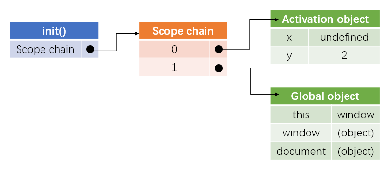

# 前端知识每日练习

1. 下面的代码执行时输出什么？说明。

   ```js
   console.log(false == '0');
   console.log(false === '0');
   ```

   执行结果为：

   ```js
   true
   false
   ```

   知识点：`==`的隐式类型转换和`===`用法

   解析：

   在JavaScript中，有两套相等运算符。三重相等运算符`===`的行为与任何传统的相等运算符相同：如果两侧的表达式具有相同的类型和相同的值，则计算结果为`true`。然而，双等号运算符在比较它们之前试图进行类型转换成`Number()`，将`false`转换为`0`,`‘0’`也转换为`0`，二者相等。因此，通常使用`===`来判断二者是否真的相等，而不是`==`。对于`!==`和`!=`也是如此。

   

2. 考虑下面的代码。输出是什么，为什么？

   ```js
   (function () {
       try {
           throw new Error();
       }catch(x) {
           var x = 1, y = 2;
           console.log(x);
       }
       console.log(x);
       console.log(y);
   })();
   ```

   执行结果为：

   ```js
   1
   undefined
   2
   ```

   知识点：预编译、作用域链、`with`和`catch`对作用域链的改变

   解析：

   1. 函数预编译：在函数预编译时，`var`语句被挂起（不包含值的初始化）到它所属的全局或函数作用域的顶部。即：

      

   2. **`with`与`catch`内的在执行时，其执行期上下文的作用域会被临时改变**，生成了一个新的可变对象并推入作用域链的头部，此时函数原本的局部变量现在处于第二个作用域链对象中。见下图：

      

      此时，第六行的`console.log(x)`从临时对象`catch variable object`中索取`x`，输出1。

   3. `catch`语句执行结束后，catch临时生成的可变对象被销毁，此时作用域链的顶端为函数的AO，如下图：

      

      此时，第8行和第9行分别输出`x`和`y`的值，得到`undefined`和`2`。

   

3. 以下代码的输出是什么？解释你的答案。

   ```js
   var a = {},
       b = {key: 'b'},
       c = {key: 'c'};
   a[b] = 123;
   a[c] = 456;
   console.log(a[b]);
   ```

   知识点：对象的属性访问与赋值

   解析：

   访问对象的属性有两种方式，一种是`obj.prop`，另一种是`obj[str(prop)]`。

   - 其中`obj.prop`会隐式的将`prop`使用`toString()`方法转化成为字符串类型`str(prop)`，然后再调用`obj[str(prop)]`。
   - 使用`obj[prop]`时，如果`prop`不是字符串，那么也会隐式调用`toString()`方法转化为字符串类型的`str(prop)`，再调用`obj[str(prop)]`。

   因此，第4行的`a[b]`相当于`a[b.toString()]`，由于`b`是对象，则`b.toString()`为`"[object Object]"`，即相当于`a["[object Object]"]=123`，此时`a`为：

   ```js
   a = {
       "[object Object]": 123,
   }
   ```

   同理，第5行的`a[c]-->a[c.toString()]-->a["[object Object]"]`，并赋值为``456`，将原`"[object Object]"`属性值覆盖成了`456`。

   ```js
   a = {
       "[object Object]": 456,
   }
   ```

   因此，第6行`console.log(a[b])`相当于`console.log(a["object Object"])`得到`456`。

   

