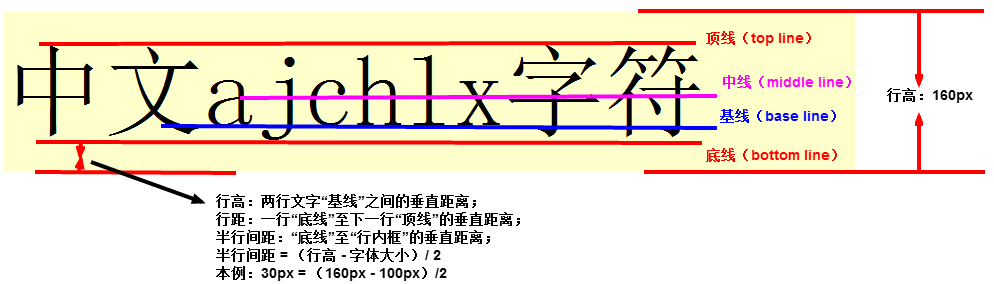

# HTML+CSS Learning Notes

[TOC]

## 网页基本组成结构

- 结构：html
- 样式：css
- 行为：JavaScript

## HTML

### 基本格式

```html
<html lang="en, zh">
    <head>
        <meta charset="utf-8|gbk">
       	<title>网页标签头</title>
        <meta content="输入关键词" name="keywords">
        <meta content="输入描述" name="description">
    </head>
    <body>
       	用于显示在网页上的HTML代码
    </body>
</html>
```


### 常用标签

```html
<html lang="en, zh" > 
    <!-- lang 是告诉搜索引擎爬虫，我们的网站是关于什么内容的-->
    <head>  <!--存放整体页面属性-->
        <meta charset="utf-8">  <!--代表编码识别语言-->
        <title>代表网页标签头 </title>
        <meta content="输入关键词" name="keywords">
        <meta content="输入描述" name="description" >
    </head> 
    <body>
        <!--基础标签-->
        <p>段落标签</p>
        <h1></h1> 一共至h6，标题标签
        <strong>加粗</strong> 加粗
        <em>斜体</em> 斜体字体
        <del>删除线</del> 删除线
        <div>容器</div>
        <span>容器</span>
        <!--容器的作用：
        	1. 结构化功能
        	2. 绑定操作，类似于style的统一定义
		-->
        
        <!--高级标签-->
        键入回车和空格都表示分格符，而非传统意义上的换行以及空格
        &nbsp 文本空格符
		<br> 换行符
		<hr> 横线
		&lt (less then)打印小于号
		&gt (greater then)打印大于号
        &copy 版权符号
		
        <!--有序列表-->
        <ol type=“1|a|A|i|I“ reversed="reversed" start="3">
            <!--
				reversed 	倒序显示
				start 		第一个选项从第几个开始（数字）
			-->
            <li>列表选项1</li>
            <li>列表选项2</li>
            <li>列表选项3</li>
        </ol>
		
        <!--无序列表 可用于导航栏的制作-->
        <ul type=“disc|square|circle”>
        	<li>列表选项1</li>
            <li>列表选项2</li>
            <li>列表选项3</li>
        </ul>
        <!--
			disc		实心圆
			square		方形
			circle		空心圆（圈）
		-->
        
        <!--image 图片标签-->
		
        <!--
            图片地址：
            1.网上的url
            2.主机的绝对路径
            3.本地的相对路径，如：./img/123.jpg
		-->
        
        <!--
        	video标签 用于播放视频
            <video src=""></video>

        video的属性
            src         视频地址
            autoplay    自动播放
            controls    控制条
            poster      视频没播放之前显示的图片
            loop        是否循环，一般用于做广告视频
            preload     预加载视频，与autoplay相冲突
            muted       静音
            width       宽度
            height      长度
    	-->
        <video src="http://dl3.webmfiles.org/elephants-dream.webm" controls="controls" poster="https://roadtovrlive-5ea0.kxcdn.com/wp-content/uploads/2015/03/youtube-logo2.jpg" loop="loop" preload="auto" muted="muted" width="500px"></video>
        
        <!--audio 音频标签-->
        <audio src="http://dl3.webmfiles.org/elephants-dream.webm" controls="controls"></audio>
        
        <!--超链接（最初功能作为锚点标签）-->
        <a href="超链接 | #id | tel:xxxx | mailto:xxxx | javascript:JavaScript代码">用户显示地址跳转</a>
        <!--
            与div标签中的id配合 进行锚点的操作（定位等操作）
            tel			打电话
            mailto 		发邮件
            javascript 	执行末尾的JavaScript语句
		-->
	
        <!--表单标签 （用于发送数据给后台）-->
		<form method="get|post" action=“发送数据的地址”>
            <!--input标签-->
            <input type="text" name="数据名" value="默认值"> 
            <input type="password" name="数据名" value="默认值">
            <input type="radio" name="数据名" value="数据值" checked="checked">	
            <!--各个具有相同数据名的radio标签互斥，只能选中一个-->
            <input type="checkbox" name="数据名" value="数据值">
            <input type="button" name="数据名" value="显示文字及数据值" onclick="javascript代码">
            <!--button按钮 用于配合JavaScript完成某些操作-->
            <input type="image" src="图片地址" name="数据名" value="数据值" onclick="javascript代码">
            <input type="reset"> 	<!--重置按钮-->
            <input type="submit"> 	<!--提交按钮-->
            <input type="email" name="数据名" value="数据值">
            <input type="url" name="数据名" value="数据值">
            <input type="number" name="数据名" value="数据值">
            <input type="date" name="数据名" value="数据值">
            <input type="color" name="数据名" value="数据值">

            <!--label标签 点击label时，光标会停在其绑定的标签上-->
            <!--方式1-->
            <label for="account">label_账号：</label>
            <input type="text" id="account">
            <!--方式2-->
            <label>
                label_密码： <input type="text">
            </label>
            
            <!--datalist标签 带选项-->
            <input type="text" name="car" list="carlist">
            <datalist id="carlist">
            	<option>奔驰</option>
                <option>奥迪</option>
                <option>宝马</option>
            </datalist>
            
            <!--select标签 下拉列表-->
            <select name="city">
                <option>北京</option>
                <option>上海</option>
                <option>广州</option>
            </select>
            
            <!--optgroup标签 分类下拉列表-->
            <select name="CITY">
                <optgroup label="山东">
                	<option>济南</option>
                    <option>青岛</option>
                    <option>菏泽</option>
                </optgroup>
                <optgroup label="广西">
                	<option>南宁</option>
                    <option>崇左</option>
                </optgroup>
            </select>
                
            <!--textarea标签 多行输入框-->
            <textarea name="self-introduction" cols="30" rows="10">请输入信息...</textarea>
        </form>
    </body>
</html >
```

### fdsaf

## CSS

### CSS的三种引入方式

1. 行间样式：在HTML标签的头部加入属性`style="css代码"`

2. 页面级CSS：在HTML的`head`里写`style`标签，在`style`标签里写CSS

3. 外部CSS文件：在HTML的`head`里写个`link`单标签，引入CSS文件

   ```HTML
   <link rel="stylesheet" type="text/css" href="CSS文件地址">
   ```

### CSS选择器

1. `id`选择器：

   ```css
   #id名 {/*CSS代码*/}
   ```

2. `class`选择器：

   ```css
   .class名 {/*CSS代码*/}
   ```

3. 属性选择器：

   ```css
   [属性名] {/*CSS代码*/}
   [属性名="属性值"] {/*CSS代码*/}
   ```

4. `标签`选择器：

   ```css
   标签名 {/*CSS代码*/}
   ```

5. 通配符选择器：

   ```css
   * {/*CSS代码*/}
   ```

### CSS优先级

`!important` > 行间样式 > `id`选择器 > `class`选择器 | 属性选择器 > 标签选择器 > 通配符选择器

> lidcatastar: 
>
> - li->line 行间样式
> - id -> id 选择器
> - c -> class 选择器
> - a -> attribute 属性选择器
> - ta -> tag 标签选择器
> - star -> * 通配符选择器

#### CSS权重

| CSS样式或选择器              | 权重     |
| ---------------------------- | -------- |
| `!important`                 | Infinity |
| 行间样式                     | 1000     |
| `id`选择器                   | 100      |
| `class`\| 属性 \| 伪类选择器 | 10       |
| 标签 \| 伪元素选择器         | 1        |
| 通配符`*`                    | 0        |

> **一个值钱的小知识**：该权重不是10进制，而是256进制。

### CSS基础属性

- `font-size: <num>px;` 默认字体大小为16px，但是开发中一般为12-14px

- `font-wight: lighter | normal | bold | bolder | 100-900的整百数;` 默认为`normal`

- `font-style: normal | italic ` 默认为`normal`

- `font-family:<字体名称>`

- `color: red | #ff0000 | #f00 | ` 
  - 颜色的3种表示方法：

    - 代表颜色的英文单词（开发中绝对不使用，测试的时候可能使用）
    - 颜色代码
      - r(00-ff) g(00-ff) b(00-ff)，组合起来为六位十六进制数，如：`#ff0033`
      - 如果代表每个颜色的两位十六进制数都相同，则可以省略成三位十六进制数，如淘宝红`#ff4400`可以简化为`f40`
    - 颜色函数
      - `rgb(<int>, <int>, <int>) ` 其中，`<int>`为0-255，与十六进制数的00-ff一一对应
      - `rgba(<int>, <int>, <int>, <float>)` 前三位同`rgb`函数，最后一位为`alpha`透明度，为0-1的浮点数
  
- css文字的行高示意图：

    

    -   顶线：文字所处的最高的水平线
    -   中线：英文字母x中间交叉点所处的水平线
    -   基线：英文字母x底部所处的水平线
    -   底线：英文字母g/j底部所处的水平线
    -   行距：一行文字底线到下一行文字顶线的垂直距离，行距平分一分为二
        -   上半行距为一行文字底线下方的半边距
        -   下半行距为下一行文字顶线上方的半边距
    -   字体大小：顶线到底线的距离
    -   行高：两行文字基线之间的垂直距离，等同于上边距线到下边距线的垂直距离

## 网页设计

### 设计思想

1. 首先确定页面布局，将整个页面区分成大的区域
2. 确定大区域的范围尺寸，利用div布局并且设置固定宽高及边框
3. 细分每个盒子中的子布局，实现具体的样式

> 类似手动递归过程= =

### 主要知识点

- 盒模型
- 元素定位的用法
- display元素框的类型
- 浮动及清除浮动
- 自适应布局、居中展示
- html基础标签和css基础样式应用
- 两栏与三栏布局

### 笔记

- `width: 100%; height: 100%;`是相对于其父级元素的宽高的100%

- 自适应居中：父级元素设置`width:100%;`, 子元素设置固定宽度和`margin: 0 auto;`即可

  ```css
  .wrapper{
      width: 100%;
  }
  .wrapper .content{
      width: 100px;
      margin: 0 auto;
  }
  ```

- 隐藏进度条，给`body`标签设置`overflow`属性为`hidden`

  - 隐藏横向进度条（无法横向拖动）：`overflow-x: hidden;`
  - 隐藏纵向进度条（无法纵向拖动）：`overflow-y: hidden;`
  - 隐藏横纵向进度条（既无法横向拖动，也无法纵向拖动）：`overflow: hidden;`

- `float`：浮动元素脱离普通流（文档流），然后按照指定方向，向左或者向右移动，碰到父级边界或者另外一个浮动元素停止。

  > `float`只脱离文档流，不脱离文本流。

- 盒模型：分为**标准盒模型**和**IE盒模型**

- 伪类与伪元素

  - `:hover :focus`等是伪类，伪类可以看作为触发的一种状态
  - 伪元素只有两个：`::after`和`::before`，伪元素可以看作真实的添加一个元素，并且可以设置该元素的内容。

- `span`是行级元素，行级元素无法设置宽高，为了给行级元素设置宽高，需要将其`display`属性设置为`inline-block`

- `inline-block`设置后，其与同级元素的默认竖直对齐方式是`bottom`，为了让其与同级元素垂直居中对齐，需要设置`vertical-align: middle;`

- `position`是用于定位：

  - `position: relative; top: -10px;` 相对于自身原本位置（即**父元素的左上角位置**）向上移动10px
  - `position: absolute; top: -10px;` 相对于**最近的含有定位的父级元素**移动10px

- 将`ul li`横过来的方法：

  ```css
  ul li{
      float: left;
  }
  ```

- 同级的块级元素是竖向排列的，如果想让同级的块级元素横向排列，可以用`float: left;`。上述的`ul li`横过来的方法也是这个原理。

- 两栏布局（有一定宽元素，另一个是自适应宽度的元素）

  - HTML中一定是先写固定宽度的div，再写自适应宽度的div。

  ```html
  <div class="parent">
      <div class="right fixed-width"></div>
      <div class="left auto-width"></div>
  </div>
  ```

  ```css
  .parent{
      position: relative;
  }
  
  /* 固定宽度的部分 */
  .parent .right.fixed-width{
      width: 50px;
      position: absolute;
      right: 0px;
  }
  
  /* 自适应宽度部分 */
  .parent .left.auto-width{
      margin-right: 50px;
  }
  ```

- `input`样式处理：

  ```css
  input{
      border: none;
      outline: 0;
      text-align: 10px;
  }
  ```
