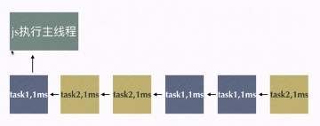

<h1 style="fontsize:28px;text-align:center;font-family:Times;color:#333">JavaScript Learning Notes</h1>

[TOC]

# Web发展史

- 前端工程师主要与浏览器打交道。
- **Mosaic**（马赛克），是互联网历史上第一个或普遍使用和能够显示图片的**网页浏览器**。于1993年问世。
- **Netscape Navigator**: Netscape（网景）公司的浏览器
- **Internet Explorer**: Microsoft 
- **Mozilla Firefox**: 2003年网景公司倒闭后，发展出来火狐浏览器
- **JavaScript**: Brendan Eich花了10天做出了JavaScript，作为Netscape Navigator浏览器的一部分首次出现在1996年。他最初的设计目标是改善网页的用户体验。初期JavaScript被命名为Livescript。后来因为和Sun公司合作，因市场宣传需要改名JavaScript。后来Sun公司被Oracle收购，JavaScript版权归Oracle所有。
- **Chrome**: 内核采用webkit，采用优化后的JavaScript引擎，引擎代号V8，因为能把js代码直接转化为机械码来执行，进而以速度快而闻名。

## 浏览器的组成

1. shell 部分：用户可以操作的部分
2. 内核部分：浏览器处理数据等的部分
   1. 渲染引擎（语法规则和渲染）
   2. JS引擎
   3. 其他模块

## 主流浏览器及其内核

| 主流浏览器 | 内核         |
| ---------- | ------------ |
| IE         | trident      |
| Chrome     | webkit/blink |
| firefox    | Gecko        |
| Opera      | presto       |
| Safari     | webkit       |

**必须知道的专业知识**

## JavaScript 的逼格（特性）

- 解释性语言：不需要编译成文件，具有跨平台的特点

  > 代码为了让机器执行操作，需要翻译成机器码，因此有两种方式：
  >
  > - 编译（编译型语言）：通篇翻译，形成一个翻译后的文件，然后机器执行该翻译后的文件。比如C语言`.c`文件编译成`.obj`文件，机器再执行`.obj`。如：C、C++、Ruby。
  >
  >   - 优点：快（可以用于偏底层的以快著称的工作，比如操作系统、游戏引擎等）
  >   - 不足：移植性不好（不跨平台）
  >
  > - 解释（解释型语言）：读一行翻译一行执行一行，逐行翻译并执行。比如Python、JavaScript、php。
  >
  >   - 优点：跨平台
  >   - 不足：稍微慢
  >
  > - Java既不是解释型语言也不是编译型语言
  >
  >   `.java`文件 –> javac 编译 –> `.class`文件 –> jvm解释执行
  >
  >   所以Java又有编译又可以跨平台。

- JavaScript引擎是单线程的

  > 单线程：一个执行体同一个时间只能做一个事。（同步）
  >
  > 多线程：一个执行体同一个时间可以做多个事。（异步）

- ECMA标准：为了获得技术优势，微软推出了JScript，CEnvi推出了ScriptEase，与JavaScript同样可以在浏览器上运行。为了统一规格，JavaScript兼容于ECM标准，因此也称为ECMAScript（ES）。

## JavaScript 执行队列

**轮转时间片**：将每个任务切成非常多的片段，每个片段只占非常少的时间，然后JS引擎依次执行各个片段（单线程，但是由于速度非常快，因此可以实现多个动效看起来像在同时执行）。



## JavaScript 三大部分

- ECMAScript
- DOM
- BOM


# JavaScript 入门

## 如何引入 JavaScript

- 页面内嵌`<script></script>`标签
- 外部引入`<script src="js_file_path"></script> `

> 注意：
>
> - `<script>`标签可以写在HTML文件中的任意位置
> - 为符合web标准（w3c标准中的一项）结构、样式、行为相分离，通常会采用外部引入
> - `<script>`标签如果既引入了外部js文件，标签内部又有js代码的话，只会执行外部文件中的js代码


## JavaScript 基本语法

### 变量 variable

- 声明变量`var <变量名>;`

- 变量赋值`<变量名> = <变量值>;`

  ```js
  // 多 var 模式
  var a = 100;
  var b = 200;
  var c = 300;
  
  // 单一 var 模式
  var a,
      b,
      c;
  a = 100;
  b = 200;
  c = 300;
  
  var a = 100,
  	b = 200,
  	c = 300;
  ```

### 命名规则

- 变量名必须以英文字母 / _ / $ 开头
- 变量名可以包括英文字母 / _  / $ /  数字
- 不可以用系统的关键字、保留字作为变量名
  - 关键字： `break` `case`  `catch` `default` `delete`  `do`  `else` `finally` `for`  `if` `in` `instanceof` `new` `return` `switch` `throw` `try` `typeof` `var` `void` `while`
  - 保留字：`abstract` `boolean` `byte` `char` `class` `const` `debugger` `double` `enum` `export` `extends` `final` `float` `goto` `implements` `import` `int` `interface` `long` `native` `package` `private` `protected` `public` `short` `static` `super` `synchronized` `throws` `transient` `volatile`

### 基本语法

#### 数据类型

- 不可改变的原始值（栈数据）: Number, String, Boolean, undefined, null
  - Number：全是浮点型数值
  - String：`‘123’`或 `“123”`
  - Boolean：只有`true` 或 `false`两个值
  - undefined： 没有定义的，即一个变量经过声明但是还没有赋值状态
  - null：空值，就是为了占位用
- 引用值（堆数据）
  - array, object, function, date, RegExp

> 注意：
>
> 原始值存在栈 stack 里，引用值大致存在堆 heap 中。
>
> - **原始值之间的互相copy**:
>
>   ```js
>   var a = 10;
>   var b = a;
>   a = 20;
>   document.write(b);
>   // 10
>   ```
>
>   声明变量是在栈结构中操作的，声明两个不同的变量`a`和`b`就是在栈中的两个位置。`a = 10`的赋值操作将`10`存在`a`所在的内存中， `b = a`的赋值操作是将栈中`a`的值拷贝一份（即副本，与原始值除了值相等没有别的关系）存在栈中`b`的内存中。
>
>   `a = 20;`，即将`a`的值改变成`20`。由于`a`和`b`的内存位置不同，对`a`的操作不会影响到`b`。
>
>   `document.write(b);`，打印输出`b`值，得到`10`。
>
> 
>
> - **引用值之间的互相copy**：
>
>   ```js
>   var arr = [1,2];
>   var arr1 = arr;
>   arr.push(3);
>   document.write(arr1);
>   // 1,2,3
>   ```
>
>   首先`var arr;`, 在栈结构中声明变量`arr`，`arr = [1,2];`由于赋的值为 **引用值** ，故将值存在堆结构（图中仅为示意，实际上是散列表的结构）中， 而栈中`arr`存储引用值的地址`heap1001`。
>
>   然后`var arr1;`，声明新一个变量`arr1`在栈结构中，`arr1 = arr;`，即将栈中`arr`存储的值（地址`heap1001`）拷贝到`arr1`中。
>
>   `arr.push(3);`即向`arr`中加入`3`。由于`arr`与`arr1`实际上指向同一块内存地址，对`arr`的修改也会对`arr1`进行修改。
>
>   `document.write(arr1)`，打印输出`arr1`，则会输出`1,2,3`。
>
> 
>
> - **引用值之间的互相copy 2**：
>
>   ```js
>   var arr = [1,2];
>   var arr1 = arr;
>   arr = [1,3];
>   document.write(arr1);
>   // 1,2
>   ```
>
>   此代码与上个例子不同的地方在于将`arr.push(3);`改为了`arr = [1,3];`。
>
>   `arr.push(3);`：不开辟新地址，而是在原有的堆数据（散列表中）进行操作
>
>   `arr = [1,3];`：开辟一个新的地址`heap1002`，将`[1,3]`存到新的地址中，并将该地址存入`arr`中。
>
>   此时，`arr`与`arr1`存储不同的地址。
>
>   `document.write(arr1)`打印输出`arr1`显示为`1,2`。 
>
> 

#### js 语句基本规则

- 语句后面要用分号`;`结束
- js 语法错误会引发后续代码终止，但不会影响其他 js 代码块
- 书写格式要规范，`= + / - ×`两边都应该有空格
- 一个代码块中的错误不会影响另一个代码块
- 行注释`//`，块注释`/* */`

#### js 操作运算符

- `+`：

  1. 数学运算
  2. 字符串连接
  3. 任何数据类型加字符串都等于字符串类型

- `-` `*` `/` `%` `=` `()`

- 优先级`=`最弱，`()`优先级较高

- `++` `--` `+=` `-=` `/=` `*=`  `%=`

  - `a++` ：存储新值，用旧值来计算

    `++a` :   存储新值，用新值（当前的值）来计算。比如

    ```js
    var a = 1;
    var b = a-- + --a;
    document.write(b)
    // 0
    
    // 相当于
    var a = 1;
    var b;
    // a-- 经过运算后 a=1-1=0 ，用旧值 1 计算
    // --a 经过运算后 a=0-1=-1，用新值 -1 计算
    b = a + a; // b = 1 + -1 = 0
    document.write(b)
    // 0
    ```


> 练习：
>
> ```javascript
> var a = 10;
> var b = ++a + 3 - a++;
> document.write(a + " " + b);
> // 12 3
> 
> // 相当于
> var a = 10;
> var b;
> ++a;
> b = a + 3 - a;
> a++;
> document.write(a + " " + b);
> ```
>
> ```js
> var a = (10 * 3 - 4 / 2 + 1) % 2,
>  b = 3;
> b %= a + 3;
> document.write(a++);
> document.write('<br>');
> document.write(--b);
> // 1
> // 2
> ```
>
> ```js
> // 交换 a 和 b 的值
> // 方式1：中间变量 tmp
> var a = 123;
> var b = 234;
> var tmp;
> tmp = a;
> a = b;
> b = tmp;
> document.write(a + " " + b);
> // 234 123
> 
> // 方式2
> var a = 123;
> var b = 234;
> a = a + b;
> b = a - b;
> a = a - b;
> document.write(a + " " + b);
> // 234 123
> ```

#### js 比较运算符

- `>` `<` `==` `>=` `<=` `!=`
- 比较结果是boolean值

#### js 逻辑运算符

- `&&` `||` `！`

- 运算结果是真实的值

- 运算方法：

  - `&&`：（碰到`false`就停）从第一个表达式开始执行判断。

    1. 如果表达式转换成布尔值是`true`而且该表达式不是最后一个表达式：
       - 查看下一个表达式并继续判断
    2. 如果表达式转换成布尔值是`true`而且该表达式是最后一个表达式：
       - 返回该表达式的值
    3. 如果表达式转换成布尔值是`false`：
       - 返回该表达式的值（不继续看后面的表达式的值，被称为 **短路效应** ）

    > 举例：
    >
    > ```js
    > var a = 123 && 654 && false && 516;
    > document.write(a);
    > // false
    > 
    > var a = 0 && 10;
    > // 0
    > 
    > var a = 10 && 5;
    > // 5
    > ```
    >
    > **`&&`短路效应常用的用法**：做一个简短的判断
    >
    > - 有一数据，只有当其非空时才执行对该数据的操作，否则就不执行
    >
    >   ```js
    >   var data = ...;
    >   data && 执行一个会用到data的语句(func(data));
    >   ```

  - `||`：（碰到`true`就停）从第一个表达式开始执行判断

    1. 如果该表达式转换成布尔值是`false`且该表达式不是最后一个表达式
       - 查看下一个表达式并继续判断
    2. 如果该表达式转换成布尔值是`false`且该表达式是最后一个表达式
       - 返回该表达式的值
    3. 如果该表达式转换成布尔值是`true`
       - 返回该表达式的值（不继续看后面的表达式的值，被称为 **短路效应** ）

    > **`||`短路效应常用的用法**：搞定兼容性
    >
    > ```js
    > div.onclick = function(e){
    >     // 在非IE浏览器中，onclick事件存储在参数 e 中；
    >     // 在IE浏览器中，onclick事件存储在 window.event 中；
    >     // 为了将该事件存储在变量 event 中，并兼容不同的浏览器，用以下语句：
    >     var event = e || window.event;
    > }
    > ```

  - `！`： 将表达式转换成布尔值后取反即可。

    > `!!(表达式)` 就是将表达式转换成其布尔逻辑值。如`!!123`为`true`、`!!NaN`为`false`。

> 注意：
>
> - 被认定为`false`的值：
>
>   `undefined` `null` `NaN` `""` `0` `false`
>
> - `NaN == NaN`的值为`false`，其余的两个相等的值用`==`连接得`true`

#### js 条件语句

- if 条件语句：

  ```js
  var score = parseInt(window.prompt('input'));
  var company;
  
  if (score > 90 && score <= 100){
      company = "alibaba";
  }else if (score > 80 && score <= 90){
      company = "tencent";
  }else if (score > 70 && score <= 80){
      company = "baidu";
  }else if (score > 60 && score <= 70){
      company = "蘑菇街";
  }else if (score <= 60){
      company = "Oh my god! you ganna be kidding me!";
  }
  else{
      company = "error!"
  }
  
  document.write(company);
  ```

- switch 分支语句：

  ```js
  var n = 2;
  switch(n){
      case 1:
          console.log('a');
          break;
      case 2:
          console.log('b');
          break;
      case 3:
          console.log('c');
          break;
  }
  // b
  ```


#### js 循环语句

- for 循环：

  ```js
  var N = 10;
  for (var i=0; i<N; i++){
      document.write(i);
  }
  // 0123456789
  ```

- while 循环：

  ```js
  var i = 0;
  while (i<10){
      document.write(a);
      i++;
  }
  // 0123456789
  ```

  > never-ending loop：死循环

- do while 循环：(知道有它就行，没人用)

  ```js
  var i=0;
  do{
      document.write('a');
      i++;
  }while(i < 10);
  // 0123456789
  ```

#### `typeof()`操作符

 `typeof()`有 6 种返回值：`number` `string` `boolean` `object` `function` `undefined` 

> **注意：这6种返回值都是字符串类型的原始值。**
>
> ```js
> typeof(undefined);
> // 'undefined'
> 
> typeof(typeof(undefined));
> // 'string'
> ```

#### 类型转换

- 显式类型转换

  - `Number()` ：将括号内的东西转化为`number`类型

    | demo       | Number(demo) |
    | :--------- | :----------- |
    | 123        | 123          |
    | ‘123’      | 123          |
    | true/false | 1/0          |
    | null       | 0            |
    | undefined  | NaN          |
    | ‘abcd’     | NaN          |

  - `parseInt()`：将括号内的东西转化为整型数值

    - 参数`radix`表示基底，范围是2-36和0，表示将`radix`进制数转换为10进制数。比如：`parseInt(10, radix=16)`表示将16进制数`10`转换为10进制数，因此会返回`16`。

    | demo       | parseInt(demo, radix=10) |
    | ---------- | ------------------------ |
    | 123.5      | 123                      |
    | ‘123.5’    | 123                      |
    | true/false | NaN                      |
    | null       | NaN                      |
    | undefined  | NaN                      |
    | ‘abcd’     | NaN                      |
    | ‘123abc’   | 123                      |

  - `parseFloat()`：将括号内的东西转化为浮点型数值（无`radix`参数）

  - `String()`：将括号内的东西转化为字符串

  - `demo.toString()`：将括号内的东西转化为字符串

    - 例子

      ```js
      var demo = 123;
      var res = demo.toString();
      console.log(typeof(res) + " : " + res);
      // string : 123
      ```

    - `undefined`和`null`不能使用`toString`。

    - 参数`radix`：表示为将10进制数转化成的目标进制。

      ```js
      // 将2进制数 10101010 转化为16进制数
      var num = 10101010;
      var res = parseInt(num, 2).toString(16); // 先用parseInt从2进制转成10进制，再用toString从10进制转成16进制
      console.log(res);
      ```

  - `Boolean()`：将括号内的东西转化为布尔型

- 隐式类型转换

  - 隐式调用`Number()`:
    - `isNaN()`：返回值是`Number(demo) == NaN`，因此`isNaN('123')`为 `false`，而`isNaN('abc')`为 `true`
    - `++` `--` `+` `-`（正负）：一旦出现上述运算符，就会首先调用`Number()`，再进行运算
    - `-` `*` `/` `%`：一旦出现上述运算符，会先调用`Number()`，再进行运算
    - `<` `>` `>=` `<=`：如果是两边有数字，那么会先调用`Number()`，再进行运算；如果两边都是字符串，那么就直接比较ASCII值
    - `==` `!=`：如果两边有数字，那么就会先调用`Number()`，再进行运算
  - 隐式调用`Boolean()`:
    - `&&` `||` `!`：一旦出现上述运算符，会先调用`Boolean()`，再进行运算
  - 隐式调用`String()`：
    - `+`：`+`两端一旦出现字符串，就会先调用`String()`，再进行运算

- 不发生类型转换

  - `===` `!==` ：`===`左右只要有一点不一样就返回`false`。

> **特例**：
>
> - `undefined > 0` –> `false`
>
> `undefined < 0` –> `false`
>
> `undefined == 0` –> `false`
>
> - `null > 0` –> `false`
>
> `null < 0` –> `false`
>
> `null == 0` –> `false`
>
> - `undefined == null` –> `true`
>
> - `NaN == NaN` –> `false`
>
> `NaN === NaN` –> `false`

**作业练习**

| 题目                                           | 答案        | 知识点                                                       |
| ---------------------------------------------- | ----------- | ------------------------------------------------------------ |
| alert(typeof(a))                               | ‘undefined’ | 未经声明的变量使用`typeof()`不会报错，会返回字符串类型的‘undefined’ |
| alert(typeof(undefined))                       | ‘undefined’ | `typeof()`返回的类型是字符串                                 |
| alert(typeof(NaN))                             | ‘number’    | `NaN`的类型是数字                                            |
| alert(typeof(null))                            | ‘object’    | `null`的类型是对象                                           |
| var a = “123abc”; alert(typeof(+a));           | ‘number’    | `+`（正号）发生隐式类型转换，调用`Number()`，因此返回类型是’number‘ |
| var a = “123abc”; alert(typeof(!!a));          | ‘boolean’   | `!`（非）发生隐式类型转换，调用`Boolean()`，因此返回类型是‘boolean’ |
| var a = “123abc”; alert(typeof(a + “”));       | ‘string’    | `+`（加号）发生隐式类型转换，调用`String()`，因此返回类型是‘string’ |
| alert(1 == “1”);                               | true        | `==`（等于）如果两边存在数字，则发生隐式类型转换，调用`Number()`，二者相等 |
| alert(NaN == NaN);                             | false       | `NaN`谁都不等于，包括他自己                                  |
| alert(NaN === NaN);                            | false       | `NaN`谁都不等于，包括他自己                                  |
| alert(NaN == undefined);                       | false       | `NaN`谁都不等于                                              |
| alert(“11” + 11);                              | ‘1111’      | `+`（加号）发生隐式类型转换，调用`String()`                  |
| alert(1 === “1”);                              | false       | `===` 强制不发生类型转换                                     |
| alert(parseInt(“123abc”));                     | 123         | `parseInt()`发生显示类型转换，截断数字                       |
| var num = 123123.34578; alert(num.toFixed(3)); | 123123.346  | `num.toFixed(3)`即保留三位有效数字                           |
| typeof(typeof(a));                             | ‘string’    | `typeof()`返回的类型是字符串                                 |

```js
var str = false + 1;
document.write(str)
// false + 1 隐式类型转换 0+1 = 1
// 1

var demo = false == 1;
document.write(demo);
// false == 1 为 false， demo = false
// false

if (typeof(a) && -true + (+undefined) + "") {
  document.write("基础扎实")
}
// typeof(a) 为 'undefined' (字符串类型)
// -true + (+undefined) + "" 为 -1 + NaN + "", 得到字符串类型的 'NaN'
// if ('undefined' && ’NaN‘) 相当于 if (true), 故执行语句
// 基础扎实

if (11 + "11" * 2 == 33) {
  document.write("基础扎实")
}
// 11 + "11" * 2 发生隐式类型转换，相当于 11 + 22 = 33
// if (33 == 33)，即 if (true)，故执行语句
// 基础扎实

!!" " + !!"" - !!false||document.write('你觉得能打印，你就是猪');
// !!" " + !!"" - !!false 相当于 true + false + false, 相当于 1 + 0 + 0 = 1
// 1 || document.write('...') 发生短路效应，判断完 1 后就停止了，不再执行后面的语句。
```


#### 函数

##### 函数定义

函数定义有两种方式：函数声明和函数表达式

1. 函数声明

   ```js
   // 调用时使用 funcName(), 其 funcName.name 是 "funcName"
   function funcName() {
       // 函数语句
   }
   ```

2. 函数表达式（大多数指的是**函数匿名表达式**）

   ```js
   // 命名函数表达式
   // 调用时使用 test(), 但是 test.name 是 "abc"
   var test = function abc(){
       document.write('a');
   }
   
   // 函数匿名表达式
   // 调用时使用 test1(), 而且 test1.name 默认为 "test1"
   vat test1 = function () {
       document.write('b');
   }
   ```

> 注意：
>
> 1. 由于函数匿名表达式非常常用，因此“函数表达式”通常指的是“函数匿名表达式”，如果要用“函数命名表达式”的话，需要进行说明
> 2. 开发规范：无论是变量名还是函数名，当有多个单词拼接的时候，采用“小头峰”风格（第一个单词首字母小写，其余的单词首字母大写），如`hasOwnProperty`.

##### 函数组成

函数组成包括 **函数名称**、**参数（形参，实参）**、**返回值**。

> 注意：
>
> 1. 在JavaScript中，形参数量和实参数量可以不等。
>
>    ```js
>    function test(a, b, c) {
>        document.write(a + " ");
>        document.write(b + " ");
>        document.write(c + " ");
>    }
>    
>    // 实参数量小于形参
>    test(1, 2)
>    // 1 2 undefined
>    
>    // 实参数量大于形参
>    test(1, 2, 3, 4)
>    // 1 2 3
>    ```
>
>    当实参数量大于形参的时候，虽然实参没有完全赋值给形参，但是在每个函数体内部，系统会自动生成一个类数组型的变量`arguments`，储存了传入函数的所有实参。
>
>    ```js
>    function test () {
>        console.log(arguments);
>        console.log(arguments.length);
>        for (var i = 0; i < arguments.length; i++) {
>            console.log(arguments[i]);
>        }
>    }
>    test(1, 2, 3);
>    // [1,2,3]
>    // 3
>    // 1
>    // 2
>    // 3
>    ```
>
> 2. 形参的数目为`函数名.length`, 实参的数目为`arguments.length`。
>
> 3. 当形参数目小于或等于实参的时候，形参和`arguments`的相应值是一一映射的；当形参数目大于实参的时候，传进了值的形参和`arguments`的相应值是一一映射的，没传进值的形参与`arguments`不映射。
>
>    ```js
>    // 形参少于等于实参
>    function test(a, b) {
>        a = 2;
>        b = 3;
>        console.log(arguments[0]);
>        console.log(arguments[1]);
>    }
>    test(1, 1);
>    // 2 3
>    
>    // 形参多于实参
>    function test(a, b, c) {
>        a = 2;
>        b = 3;
>        c = 4;
>        console.log(arguments[0]);
>        console.log(arguments[1]);
>        console.log(arguments[2]);
>    }
>    test(1, 1);
>    // 2 3 undefined
>    ```


# JavaScript运行三部曲

JavaScript运行需要有三个步骤：

1. 语法分析
2. 预编译
3. 解释执行

## 语法分析

通篇扫描一遍（不执行），查看有无语法错误（Syntax Error）。

## 预编译

### 预编译的浅显理解（不能解决所有问题）

1. 函数声明整体提升：声明的函数整体提升到逻辑的最前面。
2. 变量的声明提升：变量的声明提升到逻辑最前面。

```js
// 函数声明整体提升
console.log(test);
function test(a){}
// test函数会提升到逻辑最前面，即相当于：
function test(a){}
console.log(test);
// 输出：function test(a){}

// 变量的声明提升
console.log(a);
var a = 123;
// 变量的声明部分（var a;）会提升到逻辑最前面，即相当于：
var a;
console.log(a);
a = 123;
// 输出：undefined
```

### 预编译前奏

1. imply global 暗示全局变量：即任何变量，如果变量未经声明就赋值，此变量就为全局对象所有。

   ```js
   a = 123;
   var a = b = 123;
   ```

2. 一切声明的全局变量，全是 window 的属性。

   window 就是全局的域。

   ````js
   var a = 123;
   // 相当于：
   window.a = 123;
   ````

### 预编译四部曲（预编译的真正核心）

##### 1. 函数内的预编译

1. 创建AO对象 (Activation Object 活跃对象：作用域，执行期上下文)
2. 找形参和变量声明，将变量和形参名作为AO属性名，值为undefined
3. 将实参值和形参统一
4. 在函数体里面找函数声明，值赋予函数体

**例子**:

```js
function test(a) {
    console.log(a);
    var a = 123;
    console.log(a);
    function a() {}
    console.log(a);
    var b = function () {}
    console.log(b);
    function d() {}
}
test(1);

// 1. 创建AO对象
AO {}

// 2. 找形参和变量声明，将变量和形参名作为AO属性名，值为undefined
AO {
    a: undefined，
    b: undefined，
}

// 3. 将实参值和形参统一
AO {
    a: 1，
    b: undefined，
}

// 4. 在函数体里找函数声明，值赋予函数体
AO {
    a: function a(){}，
    b: undefined，
    d: function d() {}，
}

// 解释执行
// function a(){}
// 123
// 123
// function (){}
```

##### 2. 全局的预编译

1. 创建 GO对象（Global Object，GO和window是一个东西）
2. 找全局变量声明，将变量作为GO对象的属性名，值为undefined
3. 找函数声明，将函数名作为GO对象的属性名，值为函数体

##### 3. 全局预编译和函数预编译综合

先进行全局预编译，然后进行全局的解释执行，执行到一个函数就进行该函数的预编译过程。

```js
// 例子
console.log(test);
function test(test){
    console.log(test);
    var test = 234;
    console.log(test);
    function test(){
    }
}
test(1);
var test = 123;

// 1. 先进行全局预编译
// (1) 生成全局的GO对象
GO {}
// (2) 找全局变量声明
GO {
    test: undefined,
}
// (3) 找函数声明
GO {
	test: function test(test){
    // ...
    },
}
// 2. 全局解释执行
// functioin test(test){...}

// 3. 执行到test(1)，进行test函数的预编译
// (1) 创建AO对象
AO {}
// (2) 找形参和变量声明
AO {
	test: undefined,
}
// (3) 将实参和形参相统一
AO {
	test: 1,        
}
// (4) 找函数声明
AO {
	test: function test(){},
}
// 4. 解释执行test函数
// function test(){}
// AO {test: 234}
// 234
// 5. 继续全局解释执行
// GO {test: 123}
    
// 故总输出为：
// function test(test){...}
// function test(){}
// 234
```

### 百度关于预编译的笔试题

1. 百度笔试题 1

```js
// 1. 百度笔试题1
function bar(){
    return foo;
    foo = 10;
    function foo(){
        // body ...
    }
    var foo = 11;
}

document.write(bar());

// AO {
//     foo: function foo(){},
// }

// 输出：
// funciton foo(){ // body... }
```

2. 百度笔试题 2

```js
// 2. 百度笔试题2
document.write(bar());

function bar(){
    foo = 10;
    function foo (){
        // body...
    }
    var foo = 11;
    return foo;
}

// AO {
//     foo: 11,
// }

// 输出：
// 11
```

3. 百度13年笔试题

   下面这段js代码执行完毕后，x, y, z的值分别为多少？

```js
var x = 1, y = z = 0;
function add(n) {
    return n = n + 1;
}
y = add(x);
function add(n) {
    return n = n + 3;
}
z = add(x);
// x:1 y:4 z:4
```

解析：

1. 首先全局预编译：

   ```js
   GO {
      x: undefined，
      add: function add(n) {return n = n + 3},
   }
   ```

2. 然后全局解释执行

   - line 1 :

     ```js
     GO {
         x: 1,
         y: 0,
         z: 0,
         add: function add(n) {return n = n + 3},
     }
     ```

   - line 2 - 4 预编译的时候已经声明过了

   - line 5 执行`add`函数 （这个`add`函数是GO中的`add`函数），

     - 进行该函数的预编译

       ```js
       AO {
           n: 1,
       }
       ```

     - 进行该函数的解释执行

       ```js
       AO {
           n: 4,
       }
       ```

       将`n`返回给`y`，并销毁该AO，此时GO变成了：

       ```js
       GO {
           x: 1,
           y: 4,
           z: 0,
           add: function add(n) {return n = n + 3},
       }
       ```

   - line 6 - 8 预编译的时候已经声明过了

   - line 9 执行`add`函数 （这个`add`函数是GO中的`add`函数），

     - 进行该函数的预编译

       ```js
       AO {
           n: 1,
       }
       ```

     - 进行该函数的解释执行

       ```js
       AO {
           n: 4,
       }
       ```

       将`n`返回给`z`，并销毁该AO，此时GO变成了：

       ```js
       GO {
           x: 1,
           y: 4,
           z: 4,
           add: function add(n) {return n = n + 3},
       }
       ```

3. 运行结束，此时x为1，y为4，z为4。

## 解释执行

解释一行，执行一行。


# 作用域精解

- [[scope]]:每个JavaScript函数都是一个对象，对象中有些属性我们可以访问，但是有些不可以，这些属性仅供JavaScript引擎存取，[[scope]]就是其中一个
- [[scope]]指的就是我们所说的作用域，其中存储了执行期上下文的集合。
- 作用域链：[[scope]]中所存储的执行期上下文对象的集合，这个集合呈链式链接，我们把这种链式连接叫做作用域链。
- 运行期上下文：当函数执行时，会创建一个称为 **执行期上下文** 的内部对象 (AO)。一个执行期上下文定义了一个函数执行时的环境，函数每次执行时对应的执行上下文都是独一无二的，所以多次调用一个函数会导致创建多个执行上下文，当函数执行完毕，它所产生的执行上下文被销毁。
- 在函数里查找变量：从该函数的作用域链的顶端依次向下查找。

## 作用域链的产生、变化及消失的过程

例子：

```javascript
function a() {
    function b() {
        function c() {
            
        }
        c();
    }
    b();
}
a();
```

执行上述语句，作用域链产生及消失的过程如下：

```
a defined	a.[[scope]] -> 	0: GO
a doing		a.[[scope]] -> 	0: aAO
							1: GO
							
b defined	b.[[scope]] -> 	0: aAO
							1: GO
b doing 	b.[[scope]] ->	0: bAO
							1: aAO
							2: GO
							
c defined   c.[[scope]] ->	0: bAO
							1: aAO
							2: GO
c doing 	c.[[scope]] -> 	0: cAO
                            1: bAO
							2: aAO
							3: GO
							
c finish	c.[[scope]] ->	0: bAO
							1: aAO
							2: GO
b finish    b.[[scope]] -> 	0: aAO
							1: GO
            由于bAO中含有c函数的定义，此时销毁了bAO，c函数也被销毁，因此c.[[scope]]消失了
a finish    a.[[scope]] -> 	0: GO
			由于aAO中含有b函数的定义，此时销毁了aAO，b函数也被销毁，因此b.[[scope]]也消失了。
最后，只剩下 a.[[scope]] -> 0: GO，回归了a函数被定义时的模样。
```

> 注意：
>
> 不同函数的作用域链的相同AO对象指的是同一个AO对象，比如：
>
> a.[[scope]] -> 0: aAO, 1: GO
>
> b.[[scope]] -> 0: bAO, 1: aAO, 2: GO
>
> a.[[scope]] 中的 aAO 与 b.[[scope]] 中的 aAO 在内存中是指向同一位置的。


# 闭包

## 闭包的概念

**凡是内部的函数被保存到了外部，就会产生闭包。闭包会导致原有的作用域链不释放，造成内存泄漏。**

```js
function a () {
    function b () {
        var bbb = 234;
        console.log(aaa);
    }
    var aaa = 123; // 函数内部变量
    return b; // 传出内部函数（内部函数使用了内部变量aaa）
}
var demo = a();
demo();
// 123
```

首先`function a`进行声明，然后`a()`执行，得到自己的执行期上下文（AO），并进行`function b`的定义声明，此时`function b`也产生了自己的AO并继承`function a`的作用域链得到自己的执行期上下文，然后`function b`被return出来，赋值给了变量`demo`，此时内部函数`function b`被储存到了外部的变量`demo`中，当然包括其执行期上下文也被储存到了`demo`中。

```
a define	a.[[scope]] -> 	0：GO {demo: undefined,
                                   a: function a() {...}}
a doing 	a.[[scope]] -> 	0: aAO {aaa: 123;
									b: function b () {...}}
						   	1: GO
b define 	b.[[scope]] ->	0: aAO {aaa: 123;
									b: function b () {...}}
						   	1: GO
// demo = b
demo define	demo.[[scope]] ->	0: aAO {aaa: 123;
									    b: function b () {...}}
								1: GO {demo: function b () {...},
									   a: funciton a() {...}}
```

此时完成赋值操作后，`a()`执行结束，`function a`的AO被销毁，回到其被声明时的执行期上下文（作用域链中只有GO）。由于`function a`的AO里含有`function b`的变量声明和变量`aaa`的值，因此`function b`和`aaa`理应也被销毁，但是因为在执行结束前，`function b`的执行期上下文被储存到了`demo`中，`demo`依然可以访问其执行期上下文中存储的函数及变量。

```
a finish	a.[[scope]] ->	0：GO {demo: function b () {...},
                                   a: function a() {...}}
b disappear
demo remains demo.[[scope]] ->	0: aAO {aaa: 123;
										b: function b () {...}}
						   	   	1: GO {demo: function b () {...},
									   a: funciton a() {...}}
```

因此，当`demo()`执行时，在`function b`的作用域链的基础上，产生`demo`的AO对象，然后执行到`console.log(aaa)`时，从`a`的AO中拿到`aaa`的变量值`123`。

```
demo doing	demo.[[scope]] ->	0: demoAO {bbb: 234}
								1: aAO {aaa: 123;
										b: function b () {...}}
                                2: GO {demo: function b () {...},
									   a: funciton a() {...}}
```

此时，虽然`a`执行完了，但是`demo`的作用域链中仍然存有`a`的AO，即原有的作用域链不释放，造成内存泄漏。

> **内存泄漏**：占用了不必要的内存，导致内存的剩余量减少。占用的内存越多，剩余的内存越少，从内存的角度出发，就是内存泄漏了。

## 闭包的作用

- 实现公有变量
  - eg: 函数累加器
- 可以做缓存（存储结构）
  - eg: eater
- 可以实现封装，属性私有化。
  - eg: Person();
- 模块化开发，防止污染全局变量

### 实现共有变量

累加器：

```js
function add() {
    var count = 0;
    function demo() {
        count ++;
        console.log(count);
    }
    return demo;
}
var counter = add();
counter(); // 1
counter(); // 2
counter(); // 3
```

公有变量：

```js
function test() {
    var num = 100;
    function a () {
        num ++;
        console.log(num);
    }
    function b () {
        num --;
        console.log(num);
    }
    return [a, b];
}
var myArr = test();
myArr[0]();
myArr[1]();
// 101
// 100
```

### 可以做缓存（存储结构）

```js
function eater() {
    var food = "";
    var obj = {
        eat: function () {
            console.log("I am eating " + food);
            food = "";
        },
        push: function (myFood) {
            food = myFood;
        }
    }
    return obj;
}

var eater1 = eater();
eater1.push("banana");
eater1.eat(); // I am eating banana
```

## 立即执行函数

**立即执行函数**：针对初始化功能的函数，函数只执行一次，执行完之后就释放该函数的存储空间。

两种形式：

- `(function (){}())`：W3C推荐使用这种形式。
- `(function (){})()`

```js
(function () {
    var a = 123;
    var b = 234;
    console.log(a + b);
}())

// 带参数和传出值的的立即执行函数。
var num = (function (a, b) {
    return a+b;
}(1, 5))
```

> 解析：
>
> **只有表达式才能被执行符号`()`执行。** `function test(){}`是函数声明而不是函数表达式，因此无法执行，即`function test(){}()`会报错，而`test`是一个表达式，故`test()`可以用于执行该函数。同理，`var test = function (){}`是一个函数表达式，因此可以使用`var test = function (){}()`来执行该函数。
>
> **当一个表达式执行之后，会忽略该表达式的名字，因此表达式的名字在执行后就不存在了**。因此，`var test = function (){}()`在执行之后，无法通过`test`来引用到该函数，因此是立即执行函数。
>
> 为了让函数声明`function test (){}`也可以变成立即执行函数，需要将函数声明变成表达式，因此可以通过增加运算符的方法，比如增加正号`+`变成`+function test (){}`，增加负号`-`变成`-function test(){}`，或是增加`()`变成`(function test(){}())`或`(function test(){})()`，这样就变成了立即执行函数。
>
> 由于立即执行函数会忽略名字，所以函数声明中的函数名是不必要的，故规定`(function (){}())`或`(function (){})()`为立即执行函数的常用形式。

面试题：

```js
var x = 1;
if (function f() {}){
    x += typeof(f);
}
console.log(x);
// 1undefined
```

`function f(){}`是函数声明，加括号之后`(function f(){})`构成一个表达式，该表达式执行完了就消失了，因此`f`变成未定义的量，而正常情况下引用未定义的量会报错，而`typeof`是唯一一个使用未引用的量而不报错的情况，因此输出`‘1undefined’`。

##  闭包的常见触发及解决

### 常见触发场景

想要通过`myArr`数组存储10个函数，每个函数用于输出它的index (0-9)。

```js
function test() {
    var arr = [];
    for (var i = 0; i < 10; i++) {
        arr[i] = function (){
            document.write(i + " ");
        }
    }
    return arr;
}
var myArr = test();
for (var i = 0; i < 10; i++) {
    myArr[i]();
}
// 10 10 10 10 10 10 10 10 10 10
```

但是由于闭包问题的存在，在将`test()`的传出值`arr`传给变量`myArr`时，`myArr`中的每个函数`function (){document.write(i + " ")}`的执行期上下文都是`test()`函数的执行期上下文，而`test()`的执行期上下文中的`i`值在`test()`执行的时候已经被加到了10，因此在第11-13行的循环运行中，每个函数的`document.write(i + " ")`中的 `i` 是`test()`执行期上下文中的`i`，因此会连续输出10个`10 `。

### 解决办法

使用立即执行函数进行解决，把将从内部传出的函数用立即执行函数包裹起来，上述代码改为：

```js
function test() {
    var arr = [];
    for (var i = 0; i < 10; i++) {
        (function (j){
          arr[j] = function () {
              document.write(j + " ");
          }
        }(i))
    }
    return arr;
}
var myArr = test();
for (var i = 0; i < 10; i++) {
    myArr[i]();
}
// 0 1 2 3 4 5 6 7 8 9
```

通过在第4-8行执行一个立即执行函数，由于立即执行函数是执行过的，因此立即执行函数的执行期上下文中`j`值分别存储了`0`-`9`。而`myArr`中每个函数的`function (){document.write(j + " ")}`的执行期上下文是该立即执行函数的执行期上下文（而不是之前的`test()`函数的执行期上下文），故可以从立即执行函数的执行期上下文中找到`j`的值，并将其打印出来。因此最后会输出`0`-`9`。

即：**使用立即执行函数的作用域来储存临时变量，产生闭包后，从立即执行函数的作用域中索取变量。**


# 对象

对象的基本定义形式：

```js
var Person = {
    // Attributes
    name: "Tishacy",
    age: 18,
    sex: "male",
    health: 100,
    // Methods
    eat: function (food) {
        console.log("I am eating " + food + '.');
        this.health ++;
    },
    drink: function () {
        console.log("I am drinking.");
        this.health ++;
    }
}
```

## 属性的增、删、改、查

- 增

```js
var Person = {}
Person.name = "Tishacy"
console.log(Person.name)
// 'Tishacy'
```

- 删

```js
var Person = {name: "Tishacy"}
delete Person.name
console.log(Person.name)
// undefined
```

> **注意**：当变量未经声明就引用时会报错，但是当一个对象的属性未经声明就引用的时候不会报错，而是返回undefined。

- 改

```js
var Person = {name: "Tishacy"}
Person.name = "Chayatish"
console.log(Person.name)
// 'Chayatish'
```

- 查

```js
var Person = {name: "Tishacy"}
console.log(Person.name)
// 'Tishacy'
```

## 对象的创建方法

### plainObject（对象字面量/对象直接量）

```js
var obj = {
    // attributes and methods
}
```

### 构造函数

#### 系统自带的构造函数 `Object()`

>  这种方法百年不遇，用得非常少。

```js
var obj = new Object();
obj.name = "Tishacy";
obj.eat = function () {console.log("I am eating.")};
```

#### 自定义构造函数

自定义构造函数与普通函数在结构上没有任何区别，但是为了区分，对象的构造函数使用大驼峰式的命名方式（如：`TheFirstObject`），而函数使用小驼峰式的命名方式（如：`theFirstFunction`）。

```js
function Car() {
	this.name = "BMW";
	this.height = "1400";
    this.long = "4900";
    this.weight = 1000;
    this.health = 100;
    this.run = function () {
        this.health --;
    }
}
var car1 = new Car();
var car2 = new Car();
```

#### 构造函数内部原理

当使用`new`操作符的时候，会进行以下3个步骤：

1. 在函数体最前面隐式的加上 `this = {}`
2. 按构造函数内部的语句来执行`this.xxx = xxx`；
3. 在函数体最后隐式的返回`this`

例如下面的构造函数（注释中为`new`操作符的隐式操作内容）：

```js
function Person(name, age) {
	// var this = {}
    this.name = name;
    this.age = age;
    this.say = function () {
        console.log("I am " + this.name);
    }
    // return this
}
var pers = new Person('tish', 18);
console.log(pers.name);
// 'tish'
```

> 由于使用`new`会隐式的返回`this`对象，所以如果在构造函数最后显式的return一个自定义的对象（或其他引用值，如数组），那么就会把`new`的隐式返回`this`覆盖掉，相当于捣乱= =。比如：
>
> ```js
> function Person(name) {
>     // var this = {};
>     this.name = name;
>     // return this
>     return {};
> }
> var pers = new Person('tish')
> console.log(pers)
> // {}
> ```
>
> **冷门小知识**：如果在构造函数最后显式的返回原始值的话，系统会自动将你返回的原始值给忽略而继续隐式返回`this`对象。比如：
>
> ```js
> function Person(name) {
>     // var this = {};
>     this.name = name;
>     return 123; // 123是原始值，会被自动忽略
>     // return this;
> }
> var pers = new Person('tish')
> console.log(pers)
> // Person {name: 'tish'}
> ```

**对象和闭包结合的例题**

```js
function Person(name, age, sex){
  var a = 0;
  this.name = name;
  this.age = age;
  this.sex = sex;
  function sss() {
    a ++;
    console.log(a);
  }
  this.say = sss;
}
var oPerson = new Person();
oPerson.say(); // 1
oPerson.say(); // 2
var oPerson1 = new Person();
oPerson1.say(); // 1
```

`new`会隐式的`return this`，因此构造函数的内部函数`function sss() {...}`被储存到了外部，形成闭包，变量`a`一直在`function sss() {...}`的作用域链中无法释放，因此每调用一次`say()`就会累加一次。

新`new`的对象的作用域链会重新产生，因此与之前生成的对象相互独立。

## 包装类

- `new String(<字符串原始值>);`
- `new Boolean(<布尔原始值>);`
- `new Number(<数字原始值>);`

原始值是没有属性及方法的，但是通过包装类可以给其添加属性和方法。比如：

```js
var num = 123;
num.len = 3;
console.log(num.len)
// undefined
var newNum = new Number(num);
newNum.len = 3;
console.log(newNum.len);
// 3
```

**？**为什么原始值没有属性，但是上述代码中`num.len = 3`和`console.log(num.len)`并没有报错？

答：**当某一语句调用原始值的属性和方法时**，由于其没有属性和方法，所以系统为了尽量少报错，**会隐式的调用包装类，将原始值变成对象供你使用，并在执行该语句结束后立即销毁该对象。**例如：

```js
var str = "a string";
console.log(str.length);
// 这一句会隐式转换成 console.log(new String(str).length), 然后销毁该String对象
// 8

str.length = 2；
// 隐式转换成 new String(str).length = 2; 并销毁该String对象

console.log(str.length);
// 此时会再次隐式转换成 console.log(new String(str).length)，然后销毁该String对象
// 8
```

由于每一次调用`str.length`所`new`出的String对象是相互独立不同的对象，所以最后会输出新产生的`String(‘a string’)`对象的长度为8，而非之前所赋值的 2，因为赋值时所用的String对象已经被销毁了。

**例题**：写出以下代码的执行结果

```js
var str = "abc";
str += 1;
var test = typeof(str);
if (test.length == 6) {
    test.sign = "typeof的返回结果可能为String";
}
console.log(test.sign);
```

```js
// 输出：
// undefined
```

解析：由于`typeof(str)`的返回值是字符串类型的原始值，因此`test`是字符串原始值而第5行代码是对原始值进行属性赋值，因此会隐式调用包装类进行赋值（即相当于`new String(test).sign = “....”`），而在该语句结束之后就立即销毁了该String对象，因此第7行输出的时候，隐式调用包装类成`console.log(new String(test).sign)`，相当于新创建了一个String对象并访问其sign属性，该String没有sign属性，故返回`undefined`。

## 原型

### 定义

原型是function对象的一个属性`funcName.prototype`，它定义了构造函数制造出的对象的公共祖先。通过该构造函数产生的对象，可以继承该原型的属性和方法。原型也是对象。

利用原型特点和概念，可以提取共有属性。

```js
Car.prototype.carName = "BMW";
Car.prototype.height = 1400;
Car.prototype.long = 4900;
// or 
// Car.prototype = {
//  	carName: "BMW",
//      height: 1400,
//      long: 4900
// }
function Car(color, owner) {
  this.owner = owner;
  this.color = color;
}
var car = new Car('red', 'tishacy')
console.log(car);
```

### 原型的增、删、改、查

```js
Person.prototype.age = 18;
function Person() {
    this.name = "li"
}
var pers = new Person();
```

- 增：`Person.prototype.lastName = 'Tim';`
- 删：`delete Person.prototype.age;`
- 改：`Person.prototype.lastName = 'Tishacy';`
- 查：`var pers = new Person(); console.log(pers.lastName);`

### 对象如何查看其原型和构造函数

```js
Person.prototype.lastName = 'Tim'
function Person(name, age) {
    this.name = name;
    this.age = age;
}
var pers = new Person('tishacy', 18);
```

- **查看原型**：使用`__proto__`隐式属性可以查看对象的`prototype`（原型对象）：

  ```js
  console.log(pers.__proto__);
  // {lastName: "Tim", constructor: f}
  ```

- **查看构造函数**：使用`constructor`属性可以查看对象的构造函数：

  ```js
  console.log(pers.constructor);
  // ƒ Person(name, age) {
  //    this.name = name;
  //    this.age = age;
  // }
  ```

**练习**：

```js
// 1.
function Person() {
    // this = {
    //	 __proto__: Person.prototype;
	// }
};
Person.prototype.name = "tishacy";
var pers = new Person();
console.log(pers.name);
// tishacy
```

**解析**：给`Person`的原型`Person.__proto__`（也就是`Person.prototype`）赋上`name`属性为`‘tishacy’`。在`new Person() `以后，访问`Person`的`name`属性，由于`Person`没有`name`属性，所以会从其原型中找出`name`属性，并显示出来。

```js
// 2.
function Person() {
    // this = {
    //	 __proto__: Person.prototype;
	// }
};
Person.prototype.name = "tishacy";
Person.prototype.name = "chayatish"
var pers = new Person();
console.log(pers.name);
// chayatish
```

**解析**：在`new Person()`之前更改其原型的`name`属性值，访问时会得到更改后的`name`值。

```js
// 3.
function Person() {
    // this = {
    //	 __proto__: Person.prototype;
	// }
};
Person.prototype.name = "tishacy";
var pers = new Person();
Person.prototype.name = "chayatish";
console.log(pers.name);
// chayatish
```

**解析**：在`new Person()`之后更改其原型的`name`属性值，更改后访问`name`会得到更改后的`name`值。原因是`Person.prototype.name`是一个原始值，给原始值重新赋值只会将其在原有的内存空间中覆盖掉，因此会得到覆盖后的`name`属性。

```js
// 4.
function Person() {
    // this = {
    //	 __proto__: Person.prototype;
	// }
};
Person.prototype.name = "tishacy";
Person.prototype = {name: "chayatish"};
var pers = new Person();
console.log(pers.name);
// chayatish
```

**解析**：在`new Person()`之前更改原型`Person.prototype`为一个新的对象，则`new Person()`得到的是拥有新的原型的对象，然后访问`name`属性，会从新的原型中找到`name`，得到`‘chayatish’`。

```js
// 5.
function Person() {
    // this = {
    //	 __proto__: Person.prototype;
	// }
};
Person.prototype.name = "tishacy";
var pers = new Person();
Person.prototype = {name: "chayatish"};
console.log(pers.name);
// tishacy
```

**解析**：在`new Person()`之后更改原型`Person.prototype`为一个新的对象，由于`Person.prototype`是一个引用值而非原始值，因此重新赋值的话会将`Person.__proto__`指向另一个内存空间，而不是覆盖原有的内存空间。因此，`pers`仍然用的是原来的`pers.__proto__`，访问`pers.name`会得到`‘tishacy’`。

 

## 原型链

```js
Grand.prototype.lastName = "Deng";
function Grand(){
    
};
var grand = new Grand();

Father.prototype = grand;
function Father() {
    this.name = "xuming";
};
var father = new Father();

Son.prototype = father;
function Son() {
    this.hobby = "smoke";
};
var son = new Son();

// test
console.log(son.hobby); // "smoke"
console.log(son.name);  // "xuming"
console.log(son.lastName); // "Deng"
```

该原型链为：

​	`Object.prototype` –> `Grand` –> `Father` –> `Son`

其中Object.prototype为**大多数对象**的原型链的顶端。访问某一对象的属性时，如果该对象不存在该属性，就会沿着该对象的原型链自末端向顶端依次查找该属性，直至找到为止。


### 原型链上属性的增删改查

**练习**:

```js
Person.prototype = {
    name: "a",
    sayName: function () {
        console.log(this.name);
    }
}
function Person () {
    this.name = "b";
}
var pers = new Person();
console.log(pers.sayName());
// "b"
```

**解析**：

- *小知识点* ：`obj.method()`中的`method`里面的`this`的指向是，谁调用这个`method`，`this`就指向谁。

`pers.sayName()`时`sayName`中的`this`指的就是`pers`，因此会返回`pers.name`，即`”b“`。

**练习**：

```js
Person.prototype = {
    height: 100,
}
function Person () {
    this.say = function () {
        this.height ++;
    }
}
var pers = new Person();
pers.say();
console.log(pers.height); // 101
console.log(pers.__proto__.height); // 100
```

**解析** ：

- 如果某对象的原型的属性值是原始值，那么该对象一定无法通过自己的方法来修改覆盖原型的属性；如果是引用值，那么可以通过访问引用值再对引用值进行修改。
- `pers.say()`时，调用`this.height++`相当于`this.height = this.height + 1`，即先取出`this.height`，由于`pers`自身没有`height`属性，从其原型中找到`height`属性为`100`，然后`100+1`后再赋值给`this.height`，就是`pers.height=101`，而其原型的`height`值并不改变。
- 对`__proto__`和`prototype`的区分：
  - `prototype`是针对构造函数的，使用时是`Func.prototype`，比如`Person.prototype = {name: "tishacy"}`;
  - `__proto__`是针对对象实例的，使用时是`obj.__proto__`，比如`console.log(pers.__proto__.height)`。

 

### `Object.create()`

- 如果想让对象`b`的原型为`a`，可以使用：

  ```js
  var b = Object.create(a);
  ```

  此时，`b.__proto__`就是`a`，其中`a`有两种值，一种是对象，另一种是`null`。
- 原型为对象：

    ```js
    Person.prototype.name = "sunny";
    function Person() {};

    var pers = Object.create(Person.prototype); // 用Person的原型来构造对象
    // 由于构造函数Person中是空的，因此上面的方法完全等同于：
    var pers = Person();
    ```

    ```js
    function Father() {
        this.lastName = "Deng";
    }
    var father = new Father();
    var son = Object.create(father);
    // 即以对象father为原型来创建对象son
    ```

- 原型为`null`：

  ```js
  var firstMan = Object.create(null);
  // 此时firstMan没有原型
  ```

- 以对象为原型和以`null`为原型的区别：

  - 使用`Object.create(obj)`时，其创建的对象具有`__proto__`属性，即有原型，其原型链沿着`__proto__`属性向前追溯即可。
  - 使用`Object.create(null)`时，其创建的对象没有任何属性，即没有原型，其原型链的终端为自身。
  - **因此，不是所有的对象的原型链的终端都是`Object.prototype`，如果原型链中存在某一个对象是`Object.create(null)`来创建的，那么该对象就是原型链的终端，否则原型链的终端就是`Object.prototype`。**


## `call`和`apply`

- **`call`** : 所有的方法（函数）都有`call`方法，**`call`的作用是改变`this`的指向，其应用就是使用别人的函数来实现自己的功能。**

  - 基本用法：

    - 不传参时：`method.call()`等同于`method()`，即使函数执行。

        ```js
        function say() {
            console.log("hello");
        }
        say(); // hello
        say.call(); // hello
        ```

    - 传参时，`method.call(obj, arguments)`，将`method`中的`this`的指向变为传入的第一个参数`obj`，然后执行`method`函数。即相当于：`method`帮`obj`完成`method`中的功能。

      **例子**：

      ```js
      function say(txt) {
          console.log(txt);
      }
      say.call(say, "hello") // hello
      ```

      ```js
      // 有一个初始化函数init
      function init(name, age, gender) {
          this.name = name;
          this.age = age;
          this.gender = gender;
      }
      // 有一个空对象obj
      var obj = {};
      // 让obj使用init函数来初始化自己
      init.call(obj, "tishacy", 18, "male");
      // 此时是将init函数中的this指向了obj，再调用init函数
      // 相当于obj用了别人的函数来做了自己的事情
      console.log(obj);
      // {name: 'tishacy', age: 18, gender: 'male'}
      ```

      ```js
      function Person(name, age, gender) {
          this.name = name;
          this.age = age;
          this.gender = gender;
      }
      function Student(name, age, gender, tel, grade) {
          // 将Person函数中的this指向Student中的this，
          // 然后调用Person函数来执行自己的功能
          Person.call(this, name, age, gender);
          this.tel = tel;
          this.grade = grade;
      }
      var student = new Student("tish", 18, 'male', 139, 2015);
      console.log(student);
      // {name: 'tishacy', age: 18, gender: 'male', tel: 139, grade: 2015}
      ```

      ```js
      // 一些组件
      function Wheel(wheelSize, style) {
          this.style = style;
          this.wheelSize = wheelSize;
      }
      function Sit(c, sitColor) {
          this.c = c;
          this.sitColor = sitColor;
      }
      function Model(height, width, len) {
          this.height = height;
          this.width = width;
          this.len = len;
      }
      // 总调度
      function Car(wheelSize, style, c, sitColor, height, width, len) {
      	Wheel.call(this, wheelSize, style);
          Sit.call(this, c, sitColor);
          Model.call(this, height, width, len);
      }
      ```

- **`apply`**: **与`call`的作用一样**，用于改变`this`的指向，用别人的方法来实现自己的功能，**只有传参列表不一样**。

  - `method.call(obj, arg1, arg2, ..., argn)`

  - `method.apply(obj, [arg1, arg2, ..., argn])`

    

## 继承模式

继承（`inherit(Target, Origin)`）就是让构造函数`Target`继承另一构造函数`Origin`的原型，即使得`Target`和`Origin`的`prototype`都变成`Origin.prototype`。

**注意**：构造函数`Target`只是继承`Origin`的原型，并不继承构造函数`Origin`中的属性和方法，比如：

```js
Father.prototype.lastName = "Deng";
function Father() {
    this.money = 10000;
    this.smoke = function (){
        console.log("I am smoking.");
    }
};
function Son() {};
inherit(Son, Father);

var son = new Son();
var father = new Father();
console.log(son.lastName); // "Deng"
console.log(son.money); // undefined
console.log(son.smoke); // undefined
```

### 继承的实现方法

- **共有原型**

  ```js
  Father.prototype.lastName = "Deng";
  function Father() {}
  function Son() {}
  // 让Son的原型继承自Father的原型
  Son.prototype = Father.prototype;
  
  var father = new father;
  var son = new Son;
  console.log(father.lastName); // Deng
  console.log(son.lastName); //Deng
  ```

  ```mermaid
  graph LR
  A[Father.prototype]-->B(Father)
  A[Father.prototype]-->C(Son)
  ```

  ```js
  // 封装成“继承”函数
  function inherit(Target, Origin) {
      Target.prototype = Origin.prototype;
  }
  inherit(Son, Father);
  ```

  **注意**：这样进行继承会有一个问题，就是如果改变`Son.prototype`，那么`Father.prototype`也会发生变化，比如：

  ```js
  Father.prototype.name = "Deng";
  function Father(){};
  function Son(){};
  Son.prototype = Father.prototype; // 继承
  
  // 改变Son.prototype
  Son.prototype.name = "Tish";
  var son = new Son();
  var father = new Father();
  console.log(son.name); // Tish
  console.log(father.name); // Tish
  ```

  真正的继承应当是，当A继承自B的原型之后，A拥有B的原型中的属性和方法，并且改变A的原型并不影响B的原型。因此，使用下面的继承方法更为妥当。

- **（圣杯模式）中间层缓冲的共有原型**

  ```js
  Father.prototype.name = "Deng"
  function Father() {};
  function Mid() {};
  function Son() {};
  
  Mid.prototype = Father.prototype; // Mid继承自Father的原型
  Son.prototype = new Mid();  // 创建一个空Mid()对象作为Son的原型，该对象具有Father的原型，同时改变该对象（Son.prototyep）的属性不会影响Father.prototype.
  
  // test
  Son.prototype.name = "Tish"
  var son = new Son();
  var father = new Father();
  console.log(son.name); // Tish
  console.log(father.name); // Deng
  ```

  ```mermaid
  graph TD
  Father.prototype--Mid.prototype = Father.prototype-->Mid
  Mid--"Son.prototype = new Mid();"-->Son
  Father.prototype-->Father
  ```

  ```js
  function inherit(Target, Origin) {
      function Mid() {};
      Mid.prototype = Origin.prototype;
      Target.prototype = new Mid();
      Target.prototype.constructor = Target;
      Target.prototype.uber = Origin.prototype;
  }
  inherit(Son, Father);
  ```

  为了让中间函数`Mid()`成为私有化函数，利用闭包，形成更加高级的继承方法：

  ```js
  function inherit = (function (){
      var Mid = function (){};
      return function (Target, Origin) {
          Mid.prototype = Origin.prototype;
          Target.prototype = new Mid();
          Target.prototype.constructor = Target;
          Target.prototype.uber = Origin.prototype;
      }
  }());
  inherit(Son, Father);
  ```

###  命名冲突问题的解决

当一个页面需要多人开发的时候，会出现多个人的变量、函数命名冲突的问题。有两种解决方式，第一种比较老，使用命名空间，第二种是使用闭包解决。

#### 命名空间

定义一个全局的命名空间对象`org`来存储各人定义的所有变量和函数。

```js
org = {
    department1: {				// 部门1
        xiaohei: {				// 小黑的命名空间	
            name: "hei",
            age: 18,
            say: function () {console.log(this.name)}
        },
        xiaoming: {				// 小明的命名空间
            name: "ming",
            age: 20,
            say: function () {console.log(this.name)}
        }
    },
    department2: {				// 部门2
        xiaohong: {				// 小红的命名空间
            // ...
        },
        xiaohua: {				// 小花的命名空间
            // ...
        },
    }
}
```

用以下方法调用命名空间中的变量和函数：

```js
var hei = org.department1.xiaohei;
var ming = org.department2.xiaoming;
console.log(hei.name);		// "hei"
console.log(hei.say()); 	// "hei"
console.log(ming.name); 	// "ming"
console.log(ming.say());	// "ming"
```

这样多个人写的代码即使有相同的命名也可以互不影响。但是由于命名空间写起来和调用比较繁琐，所以现在几乎不用了，而是使用闭包的方式解决命名冲突问题。

#### 闭包的解决

使用立即执行函数，将所实现的功能包裹起来，返回总功能函数，来实现功能内部的变量和函数的私有化，避免污染全局变量。

```js
var task1 = (function (){
    var name = 'hei';
    var callName = function(){
        console.log(name);
    }
    return function() {
        callName();
    }
}());

var task2 = (function (){
    var name = 'ming';
    var callName = function(){
        console.log(name);
    }
    return function() {
        callName();
    }
}());
```

一个人使用`task1`来定义自己需要的变量和函数，另一个人使用`task2`来定义自己需要的变量和函数，通过使用闭包来使其变量和函数私有化，这样两个人的命名即使一样也不会相互影响。

### 对象的方法的连续调用

实现`obj.method1().method2()`，只需要在`method1`、`method2`中`return this`即可。比如：

```js
var person = {
    name: "Tishacy",
    say: function (words){
        console.log(words);
        return this;
    },
    drink: function (){
        console.log(this.name + " is drinking");
        return this;
    }
}

person.say("Hello").drink();
// Hello
// Tishacy is drinking.
```

### 对象枚举

遍历对象的所有属性要用到`for in`循环：

```js
var obj = {
    name: "tishacy",
    age: 18,
    sex: "male",
    __proto__: {
        lastName: "Tim",
    }
}

for (var prop in obj) {
    console.log(prop + " " + obj[prop]);
}
// name tishacy
// age 18
// sex male
// lastName Tim
```

- **`obj.hasOwnProperty(propName)`**

  ```
  obj.hasOwnProperty(propName)
  判断某一对象obj是否有某属性（不包含原型中的属性）
  param:
  	propName: 属性名
  return:
  	true: 如果obj中有该属性，并且不在原型中
  	false: 如果obj中没有该属性，或者该属性在原型中
  ```

  `for (var prop in obj)`会将`obj`中所有自设的属性都遍历出来，包括给原型中自设的属性。为了过滤调原型中的属性，仅要对象中的属性，可以使用`obj.hasOwnProperty("属性名")`。

    ```js
    for (var prop in obj) {
        if (obj.hasOwnProperty(prop)) {
            console.log(prop + " " + obj[prop]);
        }
    }
    // name tishacy
    // age 18
    // sex male
    ```

- **`A instanceof B`**

  ```
  A instanceof B
  判断A对象是否是B构造函数构造出来的，
  也就是判断A对象的原型链中是否存在B的原型。
  ```

  ```js
  [] instanceof Array;		// true
  [] instanceof Object;		// true
  123 instanceof Number;		// true
  "123" instanceof String;	// true
  ```

  **例子**：假如`function check(input)`传入的`input`既有可能是对象，也有可能是数组。对传入的`input`进行判断，并针对其类型来进行操作。

  ```js
  // 方法 1：instanceof
  function check(input) {
      if (input instanceof Array) {
          // 处理数组
      }else {
          // 处理对象
      }
  }
  
  // 方法 2：Object.prototype.toString.call()
  function check(input) {
      if (Object.prototype.toString.call(input) === "[object Array]") {
          // 处理数组
      }else{
          // Object.prototype.toString.call(input) === "[object Object]"
          // 处理对象
      }
  }
  
  // 方法 3: constructor
  function check(input) {
      if (input.constructor === Array) {
          // 处理数组
      }else{
          // input.constructor === Object
          // 处理对象
      }
  }
  ```

  


# 练习题

## 阿里的题

1. 下面代码中`console.log`的结果是[1,2,3,4,5]的是：

   ```js
   // 选项A
   function foo(x) {
       console.log(arguments);
       return x;
   }
   foo(1,2,3,4,5);
   // [1,2,3,4,5]
   
   // 选项B
   function foo(x) {
       console.log(arguments);
       return x;
   }(1,2,3,4,5)
   // 啥都没有，系统会把function和后面的(1,2,3,4,5)分开，因此只声明了函数而没有执行。
   
   // 选项C
   (function foo(x) {
       console.log(arguments);
       return x;
   }(1,2,3,4,5))
   // 立即执行函数
   // [1,2,3,4,5]
   
   // 选项D
   function foo(){
       bar.apply(null, arguments)
   }
   function bar(x){
       console.log(arguements)
   }
   foo(1,2,3,4,5)
   // [1,2,3,4,5]
   ```

2. 请问以下表达式的结果是什么？

   ```js
   parseInt(3, 8)  // 3
   parseInt(3, 2)  // NaN
   parseInt(3, 0)  // NaN/3 (chrome浏览器里parseInt传入的进制为0时，会将传入值直接输出，有些浏览器则会传出NaN)
   ```

3. 以下哪些是JavaScript语言`typeof`可能返回的结果

   ```js
   'string' // √
   'array'  // ×
   'object' // √
   'null'   // ×
   ```

   `typeof`的6中传出值：`'string'` `'number'` `'boolean'` `'function'` `'object'` `'undefined'`

4. 看看下面`alert`的结果是什么

   ```js
   function b(x, y, a) {
       arguments[2] = 10;
       alert(a);
   }
   b(1,2,3);
   // 10
   ```

   如果函数体改成下面的，结果又会是什么？

   ```js
   function b(x, y, a) {
       a = 10;
       alert(arguments[2]);
   }
   b(1,2,3);
   // 10
   ```

   因为`a`与`arguments[2]`是相互映射的。

5. 写一个方法，求一个字符串的字节长度。（提示：字符串有一个方法`charCodeAt()`；一个中文占两个字节，一个英文占一个字节。

   `charCodeAt()`方法可以返回指定位置的字符的Unicode编码，这个返回值是0-65535之间的整数。（当返回值是<=255时，为英文，反之为中文）

   语法为：`stringObject.charCodeAt(index)`

   ```js
   function byteLen(str) {
       var count, len;
       	count = len = str.length;
       for (var i = 0; i < len; i ++) {
           if (str.charCodeAt(i) > 255) {
               count ++;
           }
       }
       return count;
   }
   ```

   