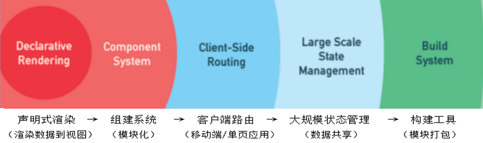

<h1 style="font-size:45px;font-style:italic;font-weight:800">Vue Notes</h1>
[TOC]

# Vue简介

## 什么是Vue

Vue：一套用于构建用户界面的渐进式框架

-   **渐进式框架**：即根据不同深度的需求，使用框架中的不同的部分。

    -   比如：当只需要构建一个简单页面的时候，只需要用到Vue声明式渲染部分就可以了，如果想要进一步的模块化，则需要使用Vue的组件系统部分。

    

## 框架和库的区别

-   库是将代码及合成一个产品，共开发者去使用，开发者去调用库中的方法来实现自己的功能。比如：jQuery，zepto
    -   库相当于一个工具集、API集合
    -   使用库中方法的控制权在自己手里
-   框架是为了解决一类问题而开发出来的产品，基于自身的特点向用户提供一套完整的解决方案。比如：Vue，react
    -   使用框架时，必须按照框架的规定来写代码，比如想要写数据，就只能放到data里面

## Vue的特点

-   易用：会html css js即可
-   灵活：不断繁荣的生态系统，可以在一个库和一套完整框架之间自如伸缩
-   高效：20KB min+gzip运行大小，超快虚拟DOM，最省心的优化

## 引入Vue

### `script`标签引入

```html
<script src="https://cdn.jsdelivr.net/npm/vue@2.6.10/dist/vue.js"></script>
```


# Vue的基本语法

## 插值表达式

- 可以在标签内部执行js代码的表达式

    ```html
    <div id="app">{{ /* js代码 */] }}</div>
    <script>
    	new Vue({
            el: 'div#app'
        });
    </script>
    ```

    -   前端页面会显示`div#app`中js代码执行的结果
    -   在标签中写入的js代码，只能是三种：
        - 基本数值类型
        - 表达式
        - Vue对象的data中定义的变量
    - 其他的如语句（声明变量语句、变量赋值语句、if条件语句，for循环语句等）会报错。

    **示例**：
    
    ```html
    <div id="app">
    	<!-- 基本数值类型 -->
        {{ 'a' }}
        {{ 10 }}
        {{ true }}
        {{ [1, 2, 3] }}
        {{ {a: 1, b:10} }}
        {{ undefined }}
        {{ null }}
        
        <!-- 表达式 -->
        {{ 1+1 }}
        {{ 1-1 }}
        {{ 2*5 }}
        {{ 10/2 }}
        {{ 5%2 }}
        {{ (5>3)? 1:0 }}
        
        <!-- Vue对象data中定义的变量 -->
        {{ a }}
        {{ b }}
    </div>
    
    <script>
    	new Vue({
            el: 'div#app',
            data: {
                a: 1,
                b: 2
            }
        })
    </script>
    ```
    
    前端页面显示：
    
    <div>a 10 true [ 1, 2, 3 ] { "a": 1, "b": 10 } 2 0 10 5 1 1 2</div>

## Vue对象

### 创建Vue对象

```html
<!-- HTML部分 -->
<div id=app>{{ a }}</div>
```

```js
/* JS部分 */
let vm = new Vue({
    el: "div#app",      // vue挂载的dom对象
    data: {a: 1},		// vue对象中的数据
    methods: {          // vue对象中的方法
		sayHi () {
            console.log("Hello Vue!");
        };
    }
})
```

### 获取vue对象中的属性和方法

-   传入的`data`中的变量，可以使用`vm.[变量名]`来访问、修改
-   Vue对象中的原有属性和方法，可以使用`vm.$[变量名|方法名]`来访问、修改

```js
// 接上段代码
console.log(vm.a, vm.b);	// 1 2
cosnole.log(vm.$el);		// <div>1</div>
console.log(vm.$data);		// {__ob__: Observer}
```

**注意**：

-   修改`vm.$data`中的变量值，会实时更新（渲染）html中相应的变量值，比如：

    ```js
    // 接上段代码
    vm.a = 123;
    // 此时，网页中所有关于a变量的部分，值都变为123
    vm.$nextTick(()=>{
        console.log(vm.$el.innerHTML);	// 123
    })
    ```

    >   其中，`vm.$nextTick(callback)`为等待页面更新渲染后执行callback函数的Vue对象中的方法

- 多次修改`vm.$data`中的变量值，只会在最后一次更改之后，更新一次数据。

    ```js
    // 接上段代码
    vm.a = 234;
    vm.a = 345;
    vm.a = 567;
    vm.$nextTick(()=>{
        console.log(vm.$el.innerHTML); // 567
    })
    ```


### Vue对象对DOM元素的挂载

vue对象对DOM对象的挂载有两种方式：

- 在`new Vue()`传入的对象参数中，用`el`来定义挂载的DOM元素
- 使用`vm.$mount(‘<selector>’)$`进行DOM元素的挂载

注意：

-   `el`参数和`$mount`方法只会有一个生效，谁先定义谁就生效。
-   `el`参数和`$mount`方法必须要写一个，否则会报错。

```js
// 使用 el 参数来挂载 div.demo 元素
new Vue({
    el: 'div.demo'
});

// 使用 $mount 方法来挂载 div.demo 元素
let vm = new Vue();
vm.$mount("div.demo");
```


# Vue指令

## `v-bind` 绑定属性

-   用法：在需要绑定的属性节点前面加上`v-bind:`，那么后面的对应属性中（`“”`内）就可以使用js表达式。

    ```html
    <input type="text" v-bind:value="1+a">
    ```

    ```js
    let vm = new Vue({
        el: "input",
        data: {
            a: 123,
        }
    });
    ```

    **示例**：img标签中的属性绑定

    ```html
    
    ```

    ```js
    let vm = new Vue({
        el: 'img',
        data: {
            name: "This is an image.",
            imgUrl: './images/pic.png'
        }
    })
    ```

-   `v-bind`的简写：`v-bind: <==> :`

    -   如果很多的属性都需要`v-bind`，那么写起来就会非常麻烦，因此推荐无论什么时候都用简写

    ```html
    
    ```

    ```js
    let vm = new Vue({
        el: "img",
        data: {
            name: "This is an image.",
            imgUrl: "./images/pic.png"
        }
    })
    ```

### 两种特殊属性的`v-bind`

有两种特殊属性的`v-bind`与其他属性不一样，`class`和`style`

- `class`：因为`class`属性中常含有多个类名，因此跟其他属性有一点不一样。使用`v-bind`绑定`class`属性的方法为：

    -   用**数组**的形式将**多个Vue变量名**写在属性中，其中每个变量对应一个类

        ```css
        /* CSS */
        .red {
            background-color: #f00;
        }
        .box {
            display: block;
            width: 100px;
            height: 100px;
        }
        ```

        ```html
        <!-- HTML -->
        <div :class="[c1, c2]"></div>
        ```

        ```js
        /* JS */
        let vm = new Vue({
            el: "div",
            data: {
                c1: "red",
                c2: "box"
            }
        })
        ```
    
    -   用**对象**的形式将**多个类**写在属性中，对象的每个key为一个类名，value为`true`|`false`来决定是否要加入该类名
    
        ```html
        <div :class="{red:true, box:true}"></div>
        ```
    
    -   用对象数组的形式将类写在属性中，相当于上两种方式的结合
    
        ```html
        <div :class="[{red: true}, {box: true}]"></div>
        ```

-   `style`：与`class`类似

    -   使用对象来添加行间样式

        ```html
        <div :style="{width: '100px', height: '100px', background-color: 'red'}"></div>
        ```

    -   使用对象数组来添加多组样式

        ```html
        <div :style="[{width: '100px', height: '100px'}, {background-color: 'red'}]"></div>
        ```

        

## `v-on`监听事件

-   用法：在标签中添加`v-on:[事件名]="handle(args)”`，并将`handle`函数放进Vue对象中的`methods`中。

    ```html
    <div id="app" v-on:click="handleClick"></div>
    ```

    ```js
    let vm = new Vue({
        el: "#app",
        methods: {
            handleClick () {
                console.log("You clicked the #app.")
            }  
        }
    })
    ```

-   `v-on:`可以简写为`@`，因此上面的html代码也可以写为：

    ```html
    <div id="app" @click="handleClick"></div>
    ```

-   `v-on`中的事件函数可以传参，比如：

    ```html
    <div id="app" @click="addAge(5)"></div>
    ```

    ```js
    let vm = new Vue({
        el: '#app',
        data: {
            age: 18
        },
        methods: {
            addAge (num) {
        		this.age += num;
            }
        }
    })
    ```

## 条件渲染

### `v-if`

-   `v-if`能够控制元素的显示与隐藏

    ```html
    <div v-if="show" style="width:100px; height:100px; border:1px solid black;"></div>
    ```

    ```js
    const vm = new Vue({
        el: "div",
        data: {
            show: true
        },
    })
    ```


###  `v-else-if` `v-else`

-   `v-else-if` `v-else`需要配合`v-if`来使用，并且之间不能有其他不含该指令的标签

    ```html
    <div id="app">
    	<div v-if="num === 0" class="box red"></div>
        <div v-else-if="num === 1" class="box blue"></div>
        <div v-else class="box green"></div>
    </div>
    ```

    ```js
    const vm = new Vue({
        el: "#app",
        data: {
            num: 0
        }
    })
    ```

    通过改变`vm.num`的值，可以实现不同的div可以被显示。

-   当需要控制一组元素显示与隐藏的时候，每个元素都添加`v-if`太麻烦，因此可以通过使用虚拟dom元素`template`标签来包裹所需要添加`v-if`

    ```html
    <template v-if-"show">
        <div class="box red"></div>
        <div class="box blue"></div>
        <div class="box green"></div>
    </template>
    ```

    ```js
    const vm = new Vue({
        el: "#app",
        data: {
            show: true
        }
    })
    ```


### `v-show`

- `v-show`：也能够控制元素的显示与隐藏
  
    ```html
    <div v-show="show" class="box red"></div>
    ```
	
	```js
	const vm = new Vue({
	    el: 'div',
	    data: {
	        show: true
	    }
	})
	```

- `v-show`与`v-if`的区别在于：
  
    -   `v-if`是通过**删除和添加dom元素**来实现元素的显示与隐藏，`v-show`是通过**添加行间样式**`display:none`来实现元素的显示与隐藏。由于频繁操作dom会造成性能浪费，因此:
        -   当需要某元素频繁地显示与隐藏时，最好是通过`v-show`来实现
	          -   当只需要判断一次某元素是否要显示与隐藏，以后都不改变的时候，比如一开始打开页面决定某些元素是否要显示时，要使用`v-if`
	-   `template`虚拟dom元素上不能添加`v-show`
	    -   原因：虚拟dom元素最终并不真的添加在页面当中，而`v-show`是通过控制行间样式中的`display: none`来控制显示与隐藏，因此控制`template`的`display`属性并不对其包裹的dom元素产生影响

## 列表渲染

### `v-for`

-   循环数组/对象：

    ```vue
    <ul>
    	<!-- 循环数组 -->    
        <li v-for="item in arr">{{ item }}</li>
        <li v-for="(item, index) in arr">{{ index }} - {{ item }}</li>
        <!-- 循环对象 -->
        <li v-for="val in obj">{{ val }}</li>
        <li v-for="(val, key) in obj">{{ key }} - {{ val }}</li>
        <li v-for="(val, key, index) in obj">{{ index }} - {{ key }} - {{ val }}</li>
        <!-- 循环数字 -->
        <li v-for="num in 10">{{ num }}</li> <!-- 数字1-10 -->
        <li v-for="(num, index) in 10">{{ index }} - {{ num }}</li>
        <!-- 循环字符串 -->
        <li v-for="c in 'tishacy'">{{ c }}</li>
        <li v-for="(c, index) in 'tishacy'">{{ index }} - {{ c }}</li>   
    </ul>
    ```

    ```js
    const vm = new Vue({
        el: 'ul',
        data: {
            arr: ['html', 'css', 'js', 'ts'],
            obj: {
                name: 'tishacy',
                age: 18,
                gender: 'male'
            }
        }
    })
    ```

-   在组件中使用`v-for`时，必须要加`:key="唯一标识"`属性（通常使用`index`），否则会报错。

    ```vue
    <template>
        <div class="root">
            <ul>
                <li v-for="(item, index) in arr" :key="index">{{ item }}</li>
        	</ul>
        </div>
    </template>
    
    <script>
    export default {
        data () {
            return {
                arr: [1, 2, 3, 4, 5]
            }
        }
    }
    </script>
    ```

    

### 渲染数组的注意点

-   **不能通过索引的方式去更改数组**，这样不会渲染页面。比如：

    ```html
    <div id="app">
        <ul>
            <li v-for="item in arr">{{ item }}</li>
        </ul>
        <button @click="handleClick">增加一项</button>
    </div>
    ```

    ```js
    const vm = new Vue({
        el: '#app',
    	data: {
            arr: ['html', 'css', 'js'],
        }, 
        methods: {
            handleClick () {
        		// 通过索引的方式来更改数组
                const length = this.arr.length;
                this.arr[length] = "ts";
                this.arr[0] = "HTML";
            }
        }
    })
    ```

    -   此时，点击`button`后，`vm.arr`确实变成了四项：

        ```js
        console.log(vm.arr);
        // ['HTML', 'css', 'js', 'ts']
        ```

        但是，页面中并没有重新渲染，而是依然是`html, css, js`3项内容。

-   **不能通过更改数组长度的方式来更改数组**，这样不会渲染页面。

    - 比如，将上面`vm.methods.handleClick`函数改为下面这样，依然无法渲染页面

        ```js
        handleClick () {
        	// 通过更改数组长度来更改数组
            this.legnth = 2;
        }
        ```

        此时，点击`button`后，`vm.arr`确实只变成了2项：

        ```js
        console.log(vm.arr);
        // ['html', 'css']
        ```

        但是，页面中并没有重新渲染，而是依然是`html, css, js`3项内容。

-   **只能通过使用数组的方法来对数组进行操作**，这样才会渲染页面。

    -   比如，将上面`vm.methods.handleClick`函数改为下面这样，就可以同步渲染页面了。

        ```js
        handleClick () {
            this.arr.push('ts');
            this.arr.splice(0, 1, 'HTML');
        }
        ```

-   原因：

    -   在Vue的内部，将数组的一些操作函数都重写了，只要调用数组中的这些函数，就会执行一个渲染页面的函数。
    -   这些被重写的数组函数称为：数组变异方法
    -   数组变异方法包括：
        -   `push` `pop` `shift` `unshift` `splice` `sort` `reverse`


### 渲染对象的注意点

- **向对象内添加或删除属性，不会渲染页面。**比如：

    ```js
    // 给vm.obj添加新属性
    vm.obj.newAttr = "newAttrValue";
    // 删除vm.obj中的属性
    delete vm.obj.name;
    // 都不会渲染页面
    ```

- **为了给对象内添加新属性，可以使用vue内部提供的`$set`方法**：

    ```js
    vm.$set(obj, key, value);
    /**
     * @param {object|string|number} obj 操作的对象
     * @param {string|number} key 设置的属性的key
     * @param {string|number|object} value 设置的属性的value
     */
    ```

    比如：`vm.$set(this.obj, ’newAttr’, ’newAttrValue’)`

    - `vm.$set`方法不只适用于对象，数组、字符串、数字等等也可以用，只不过由于字符串、数组直接赋值更改就可以渲染页面，数组通过数组变异函数也可以渲染页面，而对象只能通过`vm.$set`方法来添加属性，因此`vm.$set`方法在对象中更常用一些。


## 双向数据绑定

-   `v-model`：实现数据的双向绑定

    -   不使用`v-model`的双向数据绑定：

        ```html
        <div id="app">
        	<input type="text" :value="value" @input="handleInput">
            <span>{{ value }}</span>
        </div>
        ```

        ```js
        const vm = new Vue({
            el: '#app',
            data: {
                value: "tishacy"
            },
            methods: {
                handleInput (e) {
                    this.value = e.target.value;
                }
            }
        })
        ```

    -   使用`v-model`的双向数据绑定

        -   `v-model`是input/textarea标签`:value@input`的语法糖

            ```html
            <div id="app">
                <!-- input:text标签 双向绑定数据 => value -->
                <input type="text" v-model="value"> {{ value }} <br>
                <!-- textarea标签 双向绑定数据 => content -->
                <textarea v-model="content"></textarea> {{ content }} <br>
                <!-- input:checkbox 双向绑定数据 => checked -->
                <input type="checkbox" v-model="checked"> {{ checked }} <br>
                <!-- input多个复选框 双向绑定数据 => checkedList-->
                <label for="html">html</label>
                <input type="checkbox" value="html" id="html" v-model="checkedList">
                <label for="js">js</label>
                <input type="checkbox" value="js" id="js" v-model="checkedList">
                <label for="vue">vue</label>
                <input type="checkbox" value="vue" id="vue" v-model="checkedList">
                <div>{{ checkedList }}</div>
                <!-- input多个单选项 双向绑定数据 => picked -->
                <label for="html">html</label>
                <input type="radio" value="html" id="html" v-model="picked">
                <label for="js">js</label>
                <input type="radio" value="js" id="js" v-model="picked">
                <label for="vue">vue</label>
                <input type="radio" value="vue" id="vue" v-model="picked">
                <div>{{ picked }} </div>
                <!-- select下拉框 -->
                <select v-model="selected" value="selected">
                    <option>请选择</option>
                    <option value="html">html</option>
                    <option value="js">js</option>
                    <option value="vue">vue</option>
                </select>
                <div>{{ selected }}</div>
                <!-- select多选框 -->
                <select v-model="selectedList" value="selectedList" multiple>
                    <option value="html">html</option>
                    <option value="js">js</option>
                    <option value="vue">vue</option>
                </select>
                <div>{{ selectedList }}</div>
            </div>
            ```

            ```js
            const vm = new Vue({
                el: '#app',
                data: {
                    value: 'tishacy',
                    content: 'This is a paragraph',
                    checked: true,
                    checkedList: [],
                    picked: '',
                    selected: ''
                }
            })
            ```

## 侦听器和计算属性

-   侦听器`watch`

    ```js
    const vm = new Vue({
    	el: '#app',
        data: {
    		name: "tishacy"
        },
        watch: {
            name (val, oldVal) {
                // 当 this.name 的值改变时，就会执行该函数
              	console.log(val, oldVal);
            }
        }
    })
    ```
    
-   计算属性`computed`

    ```html
    <div id="#app">
        <!-- 与正常属性一样取用计算属性 -->
    	{{ desc }}
    </div>
    ```

    ```js
    const vm = new Vue({
        el: '#app',
        data: {
            name: 'tishacy',
            age: 18
        },
        computed: {
            desc () {
                // 只有当该函数所涉及到的数据改变的时候，才去执行
                return `My name is ${name}, age is ${age}`;
            }
        }
    })
    ```
    
-   `data` `methods` `computed`查找顺序：
    `data` > `methods` > `computed`
    
    - 当需要写逻辑的时候，或者需要写封装函数的函数的时候，写在`methods`里面
    - 当需要返回一个计算后的值的时候，写在`computed`里面
    - 当在一个属性改变时需要做一些事情的时候，写在`watch`里面

# Vue组件

-   vue的组件分为两部分：全局组件 和 局部组件

##全局组件

-   全局组件：使用`Vue.component`单独构建的组件

    ```js
    Vue.component('helloWorld', {
        template: `
    		<div>
    			<button @click="handleClick">click</button>
    			<span>{{ msg }}</span>
    		</div>`,
        data () {
            return {
                msg: 'hello vue component!'
            }
        },
        methods: {
            handleClick () {
                this.msg = 'Hello Vue Component!'
            }
        }
    })
    ```

    ```html
    <hello-world></hello-world>
    ```

    - 注意：
        - 注册全局组件的代码要写在实例化Vue对象之前。
        - 注册组件的名字可以有三种格式：
            - 小驼峰式：`”helloWorld“`
            - 大驼峰式：`"HelloWorld"`
            - 中划线式：`"hello-world"`
        - 无论注册组件使用哪种方式的名字，在html中使用组件必须使用中划线式：`<hello-world></hello-world>`

## 局部组件

-   局部组件：在`Vue`对象实例内部定义的组件，局部组件优先度更高。

    ```js
    const vm = new Vue({
        el: '#app',
        data () {
            return {
    						msg: 'hello vue component!'
            }
        },
        components: {
            'hello': {
                template: "<div>Hello</div>"
            }
        }
    })
    ```
    
    -   注意：
        -   注册组件的名字格式以及使用组件的格式与vue局部组件相同

## 父组件与子组件的数据传递

-   父组件向子组件数据传递：

    -   需要三步：
        -   （定义父组件需要传的数据）Vue对象实例的`data`中定义需要传递的数据，比如下面的示例中的`title` `content`
        -   （定义子组件需要接收的数据）Vue对象实例中的components中的所定义的组件中需要有`props`属性，有两种格式：
            -   数组形式：包含字符串形式的传递的数据变量名，如示例中的`[“title”, “content”]`
            -   对象形式：包含对象形式的传递的数据，所传递的数据变量名作为key，value仍为一个对象，规定该数据的一些属性，比如类型、默认值、校验函数等，见示例。
        -   （传递数据）在html中使用组件的时候要以`:数据变量名="数据变量名"`绑定所传递的数据，如示例中的`:title=“title” :content=“content”`。
    -   如果要将data中的一个对象中的全部属性传递给子组件，那么可以使用`v-bind=‘需要传递的对象’`，见示例。
    
-   子组件向父组件的数据传递：

    -   需要两步
        -   在子组件中触发某一事件，并在该事件触发的函数中使用`this.$emit(‘触发事件函数名’, 需要传递的数据)`来注册父组件触发的事件。
        -   父组件中的`methods`中添加相应的触发事件函数，就可以接收到子组件传递的数据

-   CDN示例：

    ```js
    const vm = new Vue({
        el: "#app",
        data: {
            /* 定义父组件需要传的数据 */
            title: 'This is a title',
            content: 'This is the component',
            info: {
            	name: 'tishacy',
        		age: 18,
       		}
        },
        methods: {
            // 接收子组件的数据
            sonToParent (sonAge) {
                this.info.age = sonAge;
            }
        }
        components: {
            'hello': {
                /* 定义子组件需要接受的数据 */
                // 数组形式的props属性
                // props: ["title", "content"],
                // 对象形式的props属性
                props: {
                    title: {
                        type: String,
                        default: 'TITLE',
                        validator (val) {
                            /** 校验函数，返回一个布尔值
                             * @param {string} val 传递的‘title’数据
                             * @returns {boolean} 
                             * 		true 校验成功，将数据传递给当前组件并渲染
                             *		false 校验失败，报错提醒，但是仍然将数据传递给当前组件并渲染
                             */
                            return val.length > 5
                        }
                    },
                    content: {
                        type: String,
                        required: true,
                    },
                    name: {
                        type: String,
                    },
                    age: {
                        type: Number,
                    }
                },
                data () {
                	return {
                        ownAge: this.age
                    }
                },
                template: `<div>
    				<h1>{{ title }}</h1>
    				<p>{{ content }}</p>
    				<div>{{ ownAge }}</div>
    				<button @click="handleClick">add</button>
    			</div>`,
                methods: {
                    handleClick () {
                        this.ownAge ++;
                        // 给父组件传递this.ownAge数据
                        this.$emit('toParent', this.ownAge);
                    }
                }
            }
        }
    })
    ```

    ```html
    <!-- 父组件与子组件的数据传递 -->
    <hello :title="title" :content="content" v-bind="info" @toParent="sonToParent"></hello>
    ```

-   脚手架示例

    -   父组件向子组件传数据

        ```vue
        <!-- 父组件 -->
        <template>
            <div class="parentComponent">
                <!-- 2.将数据传递给子组件 -->
                <son-component :transData="transData"></son-component>
            </div>
        </template>
        
        <script>
        import sonComponent from "./components/sonComponent.vue";
            
        export default {
            data () {
                return {
            		// 1. 定义传递的值
                    transData: "Data transfered to son component",
                }
            },
            components: {
                "son-component": sonComponent
            }
        }
        </script>
        ```

        ```vue
        <!-- 子组件 -->
        <template>
        	<div class="sonComponent">
                <!-- 4. 使用所传递的数据 -->
                传递的数据为：{{ transData }}
            </div>
        </template>
        
        <script>
        export default {
        	// 3. 在子组件中的prop中设置所接收到的数据    
            props: {
                'transData': {
                    type: String
                }
            }
        }
    </script>
        ```

    -   子组件向父组件传递数据（需要通过触发事件的方式）
    
        ```vue
        <!-- 子组件 -->
        <template>
        	<div class="sonComponent">
                <!-- 2. 通过触发事件来向父组件传值 -->
                <button @click="transData"></button>
            </div>
        </template>
        
        <script>
        export default {
            data() {
                // 1. 定义需要传递给父组件的数据
                'tdata': 'Data transfered to parent component'
            },
            methods: {
                transData () {
                    // 3. 注册父组件触发的事件，并将数据传给父组件
                    this.$emit("sonToParent", this.tdata);
                }
            }
        }
    </script>
        ```
    
        ```vue
        <!-- 父组件 -->
        <template>
        	<div class="parentComponent">
                <!-- 4. 父组件中使用子组件注册的触发事件函数，来获取子组件所传来的值 -->
            	<son-component @sonToPrent="sonToParent"></son-component>
                <h1>{{ title }}</h1>
            </div>
        </template>
        
        <script>
        export default {
            data () {
                return {
                    title: ""
                }
            }
            methods: {
                sonToParent(tdata) {
                    // 5. 使用子组件中所传递的值
                    this.title = tdata;
                }
            }
        }
    </script>
        ```
    
        

## ref引用

- ref引用：为了在Vue对象中使用dom元素，可以在对应的dom元素上加上ref属性，并在Vue对象中对应的组件中使用`this.$refs.ref属性值`就可以使用所引用的dom元素

    - dom对象的引用是该对象，组件的引用是组件的实例对象
    - ref同名时，后添加的会覆盖前面添加的，引用指向的是最后一个元素
    - 在`v-for`时添加引用，引用的值类型是数组，数组里面是一个一个的dom对象/组件实例对象

- 示例：

    ```html
    <div id="app">
        <!-- 使用组件并定义其ref -->
        <change-box-background ref="cbb"></change-box-background>
        <button @click="handleClick">查看组件的refs</button>
    </div>
    ```

    ```js
    const vm = new Vue({
        el: '#app',
        data: {
        },
        methods: {
            handleClick () {
                // 使用this.$refs获取相应的组件对象
                console.log(this.$refs.cbb);
            }
        },
        components: {
            'changeBoxBackground': {
                template: `<div>
    					<button 
    						v-for="color in colorArr"
    						:key="color"
    						:style="{backgroundColor: color}"
    						@click="handleClick(color)"
    						ref="btn"
    					>{{ color }}</button>
    					<div class="box" ref="box"></div>
                    </div>`,
                data () {
                    return {
                        colorArr: ['ref', 'green', 'blue', 'yellow'],
                    }
                },
                methods: {
                    handleClick (color) {
                        // 使用this.$refs来获取相应的dom对象
                        this.$refs.box.style.backgroundColor = color;
                        console.log(this.$refs.btn);
                        // this.$refs.btn是一个包含4个button的dom对象的数组
                    }
                }
            }
        }
    })
    ```


# Vue脚手架

## 安装脚手架

-   安装node > 8.9

-   安装3.x版本vue脚手架

    ```bash
    # 卸载旧版本的vue脚手架
    $ npm uninstall vue-cli -g
    
    # 安装脚手架，用于生成项目
    $ npm install -g @vue/cli
    # 快速原型开发 编译.vue文件
    $ npm install -g @vue/cli-service-global
    # 查看vue-cli版本：
    $ vue --version
    
    # 如果仍然需要使用旧版本的vue init功能，可以全局安装一个桥接工具
    $ npm install -g @vue/cli-init	# 拉取旧版本
    ```

-   安装Vetur（VScode插件），来高亮显示vue代码

## Vue项目目录结构

```bash
.
├── README.md					# README
├── babel.config.js				# Babel的配置文件
├── node_modules				# npm install执行后所安装的库
├── package-lock.json			# 依赖
├── package.json				# 项目的基本信息，其中：“script”中是npm run可以执行的命令；“dependencies”和“devDependencies”是项目的依赖，执行npm install时会将这两部分的库下载到node_modules中
├── public									
│   ├── favicon.ico				# index.html中的图标文件
│   └── index.html				# 项目的入口html文件
└── src							# 项目的源码部分
    ├── App.vue					# 项目的根组件
    ├── assets					# 项目的静态文件，静态的css/js/image等文件
    │   └── logo.png
    ├── components				# 项目用到的Vue组件
    │   └── HelloWorld.vue
    └── main.js					# 项目的入口js文件 进入index.html入口后，vue会自动引入该js文件 该js文件中引入了vue库和App.vue根组件，并将根组件挂载到相应的dom元素上
```

## `.vue`文件

-   一个vue文件就是一个vue组件，包含三个部分：
    -   `template`标签（结构）：将组件的模板写在`template`标签内
    -   `script`标签（行为）：将组件使用的数据、行为、计算属性等其他定义组件的内容写在script标签的`export default {}`中
    -   `style`标签（样式）：将组件涉及到的css样式写入`style`标签
    
-   示例：`App.vue`文件

    ```vue
    <!-- 结构 -->
    <template>
    		<div> <!-- template标签中只能有一个根dom元素 -->
            <h1>{{ msg }}</h1>
            <div>I am a component.</div>
    	</div>
    </template>
    
    <!-- 行为 -->
    <script>
    export default {
        data () {
            return {
                msg: "Hello world"
            }
        },
        methods: {
        }
}
    </script>
    
    <!-- 样式 -->
    <style>
        div {
           backgroundColor: red;
        }
    </style>
    ```
    
    ```bash
    # 编译App.vue文件
    $ vue serve App.vue
    ```


# Vue生命周期

<div style="width: 500px; margin:0 auto;">
	
    <p style="text-align: center">
        Vue的生命周期
    </p>
</div>

## 生命周期中的钩子函数

- 钩子函数可以让开发者在一个组件的生命周期饿某些关键节点处执行自己需要的函数。
  - `beforeCreated`: 初始化事件和生命周期之后，但是在初始化注入和校验之前
    - 这个时候实例还没有被创建，所以无法知道`data`，也不能用`watch`监听
  - `created`: 在初始化注入和校验之后
    - 此时实例已经创建，可以获取data和使用watch进行监听数据，但是页面还是空白的
  - `beforeMount`: 已经加载template之后，但是还没有挂载到对应的DOM元素上
    - 页面挂载前，此时页面依然是空白的，这时render函数首次被调用
  - `mounted`: 将template挂载到对应的DOM元素之后
    - 页面被挂载了，该函数执行后你可以看到页面中的内容，也可以访问到dom
  - `beforeUpdate`：实例数据修改后，但是还没有重新渲染DOM之前
  - `updated`: 实例数据修改后，并且已经重新渲染DOM之后
  - `beforeDestroy`: 当调用`$destroy()`函数之后，但是还没有解除绑定、销毁子组件和事件监听器之前
    - 页面离开之前被调用，清除定时器，或者第三方的一些DOM结构
  - `destroyed`: 当调用`$destroy()`函数之后，并且已经解除绑定和销毁子组件以及事件监听器之后


# Vue的插槽slot

- slot的目的：将父组件中定义的dom标签传递给子组件

  - 没有slot的时候，父组件向子组件进行数据传递时只能传递变量值，不能传递DOM标签，slot就是为了能将父组件定义的slot标签传递给子组件。

- 使用步骤：

  - 父组件

    - 定义slot标签。
      - 方式是在子组件双标签内部写任意标签，只需要添加属性`slot="slot-name"`即可，如：`<h1 slot="title"></h1>`
    - 定义slot标签中传递的数据，需要写在sender（传递方，即父组件）的`data`中
    - 定义slot标签的样式：写在sender或者receiver都可以，但是推荐写在定义标签的一方
      - 注意定义样式时不可以使用`div[slot="slot-name"]`来对应DOM元素，因为slot是虚拟DOM的属性，最终显示的DOM中并没有slot属性

  - 子组件

    - 用slot标签来占位，用来接收父组件传过来的标签。
      - 方式是用slot标签，并添加属性`name=”slot-name“`即可，如：`<slot name=”title“></slot>`

    - 将父组件传递过来的数据写在`props`中

- 示例：

  ```vue
  <!-- 父组件 -->
  <template>
      <div id="parentCompoennt">
      	<son-component>
              <!-- slot 插槽: 含有slot属性的标签，会传递到子组件的对应slot中 -->
              <!-- 1. 定义slot标签 -->
              <div class="before-title" slot="before-title">{{ beforeTitle }}</div>
              <div class="after-title" slot="after-title">{{ afterTitle }}</div>
      	</son-component>
      </div>
  </template>
  
  <script>
  import sonComponent from './components/sonComponent.vue';
  
  export default {
      components: {
          "som-component": sonComponent;
      },
      data() {
          return {
              // 2. slot标签中传递的数据需要写在sender（传递方，即父组件）的data中
          	beforeTitle: 'This is the text before title.',
              afterTitle: 'This is the text after title.'
          }
      },
  }
  </script>
  
  <style scoped>
      /* 3. slot标签的样式：写在sender或者receiver都可以，但是推荐写在定义标签的一方, 注意定义样式时不可以使用div[slot="slot-name"]来对应标签 */
      div.before-title {
          font-style: italic;
      }
      div.after-title {
          font-weight: bold;
      }
  </style>
  ```

  ```vue
  <!-- 子组件 -->
  <template>
  	<div id="sonComponent">
          <!-- 4. 用slot标签来占位，用来接收父组件传过来的标签 -->
          <slot name="before-title">{{ beforeTitle }}</slot>
          <h1>This is the title</h1>
          <slot name="after-title">{{ afterTitle }}</slot>
      </div>
  </template>
  
  <script>
  export default {
      // 5. 将父组件传递过来的数据写在props中
      props: {
          beforeTitle: {},
          afterTitle: {}
      }
  }
  </script>
  
  <style scoped>
  </style>
  ```

  


